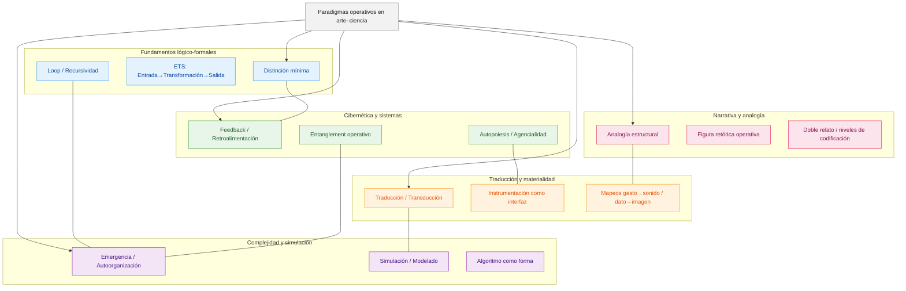

1. Data Art – uso creativo de bases de datos científicas como materia artística (visual, sonora, performativa)
2. Visualización artística de información – generación de gráficos, mapas, animaciones a partir de datos cuantificables
3. Sonificación de datos – conversión de datos en estructuras sonoras o musicales
4. Modelado matemático – uso de ecuaciones, funciones o sistemas dinámicos como estructura de obra (ej. Lorenz, Mandelbrot)
5. Algoritmos evolutivos – simulación de selección natural para generar formas, sonidos o procesos artísticos
6. Interactividad sensible – obras que responden en tiempo real a estímulos (movimiento, voz, sensores, etc.)
7. Biofeedback – retroalimentación de señales biológicas (EEG, ritmo cardíaco, EMG) para controlar parámetros artísticos
8. Interfaces hápticas o sensoriales – dispositivos que involucran el tacto, la presión, la temperatura como input/output
9. Autoorganización – estructuras generadas por reglas internas simples, sin control central (sistemas emergentes)
10. Robótica – uso de actuadores, motores y microcontroladores en la creación de artefactos performativos o instalativos
11. Ciencia ciudadana – colaboración con comunidades científicas para recolectar y reutilizar datos en clave artística
12. Inteligencia artificial – entrenamiento de modelos (ML, GANs, transformers) para generar imágenes, textos o sonidos
13. Machine learning creativo – entrenamiento supervisado o no supervisado sobre datasets propios para generar obra
14. Neuroarte – visualización o intervención de procesos neuronales mediante arte (EEG, BCI, estimulación cerebral)
15. Generative art – uso de sistemas autónomos (reglas, scripts, autómatas) para producir variaciones artísticas
16. Procesamiento físico de materiales – interacción directa con fenómenos como resonancia, luz, presión, fluidos, etc.
17. Instrumentación científica performativa – reutilización de herramientas científicas como interfaz artística (e.g. osciloscopios, acelerómetros, microscopios)
18. Microsonicidad / microvisión – foco en escalas infrasonoras o microscópicas como material compositivo
19. Simulación computacional – creación de entornos artificiales para explorar fenómenos físicos, químicos, ecológicos
20. Topología y geometría como forma artística – uso de espacios no-euclídeos, superficies complejas, hiperformas
21. Biología sintética – arte con organismos modificados o cultivo celular en laboratorio (técnicas húmedas)
22. Arte especulativo – extrapolación de escenarios científicos para crear objetos narrativos o ficciones performativas
23. Protocolos experimentales como partitura – obras guiadas por esquemas de procedimiento inspirados en ciencia
24. Medición ambiental – uso de variables físicas (CO₂, temperatura, humedad, radiación) como entrada compositiva
25. Cartografías críticas – elaboración de mapas conceptuales, ecológicos o afectivos derivados de estructuras científicas
26. Sistemas de control retroalimentado (feedback) – cadenas de audio/luz/movimiento que se modulan entre sí
27. Modelado físico o físico-digital – integración de comportamiento material con simulaciones computacionales (sound sculpture, soft robotics)
28. Codificación performativa (live coding) – programación en vivo como performance artística
29. Técnica de redes complejas – visualización o interacción con grafos científicos, sociales o neuronales
30. Métodos paramétricos – diseño asistido por parámetros controlables como en arquitectura digital o síntesis sonora

# paradigmas operativos

## Objetivo
Introducir  la noción de paradigma operativo como estructura lógica-metodológica que articula intuición y razón en la creación artística con base científica y algorítmica.

---
## Niveles
### filosófico-especulativo
- Binomio intuición–razón (B. Russell, Mysticism and Logic): la intuición abre, funda , desvía; la razón estructura, filtra, nombra, elige.
- Lógica de la distinción (G. Spencer-Brown, Laws of Form): toda forma emerge al trazar una diferencia; la operación es el acto fundante.
- Teoría de sistemas y autopoiesis (F. Varela, H. Maturana): la obra y el proceso creativo como sistemas cerrados operativamente pero abiertos al entorno.
- Filosofía de la técnica (G. Simondon): nociones de concretización y transducción como movimientos entre dominios materiales y conceptuales.

---

### metacognitivo
- Los paradigmas operativos actúan como estructuras de segundo orden: no son técnicas ni herramientas concretas, sino formas de pensar y organizar procesos.
- La metacognición consiste en identificar en qué paradigma estamos trabajando y decidir conscientemente si lo mantenemos, lo alteramos o lo hibridamos.

- Ejemplos:
- Entrada → Transformación → Salida (ETS) y sus variantes con retroalimentación.
- Traducción / transducción como cambio de dominio, analogía estructural.
- Complejidad y  emergencia como generadoras de forma.

---

### matriciales

- ETS
- Distinción mínima (Spencer-Brown)
- Feedback / retroalimentación / Loop / recursividad
- Emergencia / autoorganización / complejidad / autopoiesis (Varela...   teóricos de la complejidad )
- Transducción / traducción, Analogía estructural.
- Simulación / Hiperrealidad

Cada uno con sus referentes teóricos, procedimientos técnicos y ejemplos artísticos.

---

### de proyección algorítmica en la materia artística
- El algoritmo se convierte en el equivalente lógico del paradigma operativo: la codificación explícita de una operación que puede iterarse, variarse y medirse.
- Ejemplos:
	- Uso de sistemas de feedback físico-digital en performance sonora.
	- Traducción de datos científicos a estructuras visuales o musicales.
	- Simulación de sistemas complejos para generar narrativa audiovisual.

## metodología 
- los paradigmas operativos actúen como puentes:
	- Entre modelos científicos (matemática, física, biología) y la materia artística.
	- Entre algoritmos y material sensible (sonoro, visual, performativo).

1. Modelar un fenómeno o concepto en un paradigma operativo.
2. Implementarlo en un entorno algorítmico (código, simulación, dispositivo).
3. Materializarlo en un objeto o experiencia artística.

---

### Aplicación en 5 etapas

1. identificar en obras referenciales qué paradigma operativo subyace. 
2. Definir el paradigma operativo 
	1. filosóficamente:
		- enuncia la intuición fundante en un lenguaje especulativo sin necesariamente un soporte empírico. (*ej: la realimentación modula la agencia del performer hasta convertirlo en interfaz*)
	2. matemáticamente:
		- traducir a una fórmula lógica, matemática o de diagrama de flujo. 
		- puede incluir pseudocódigo, fórmulas, representaciones simbólicas (mermaid, UML, Spencer-Brown).
		- aquí se define la operación matricial del paradigma.
3. Demostración experimental: 
	1. Aislar su funcionamiento en una demostración / sonificación / visualización interactiva. 
4. Diseñar una micro-obra en 7 días partiendo de un único paradigma operativo elegido.
5. Reflexión: registrar cómo interactuaron intuición y razón en el proceso en un texto de 600-2000 palabras en latex. 
	1. Debe contener como germen el modelo de producción de un paper científico
		1. introducción (incluye la literatura revisada o estado del arte)
		2. metodología (matriz elegida)
		3. demostración, 
		4. conclusiones, crítica, refutación.
		5. referencias en bibtex.

---

