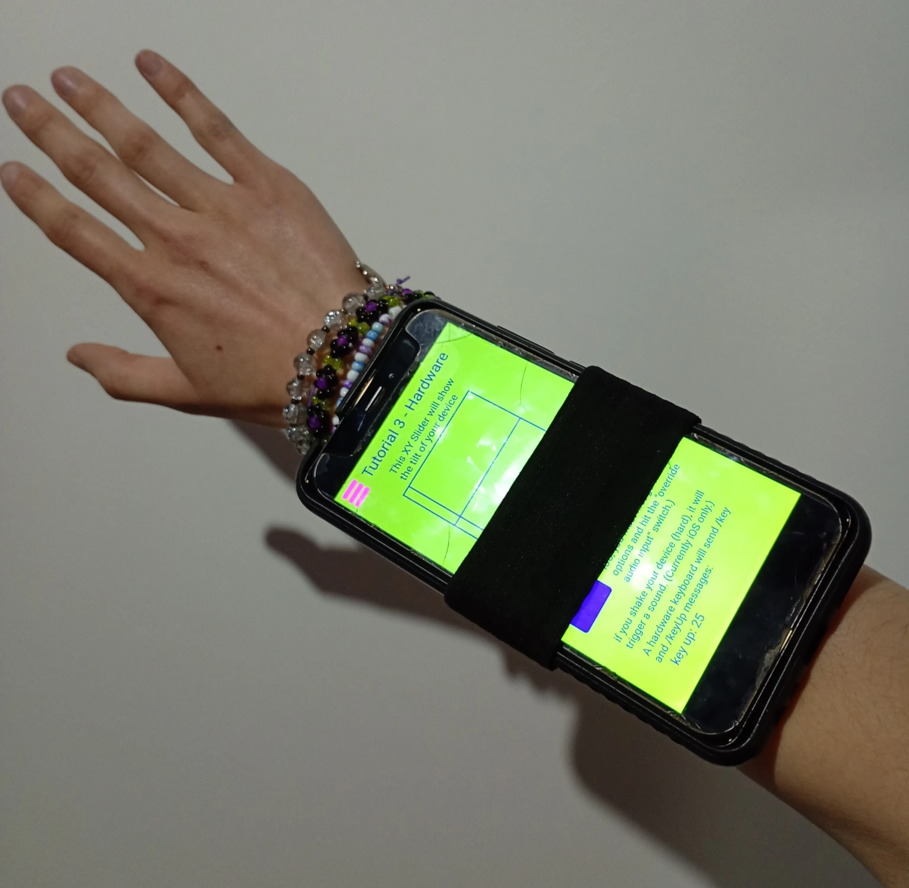
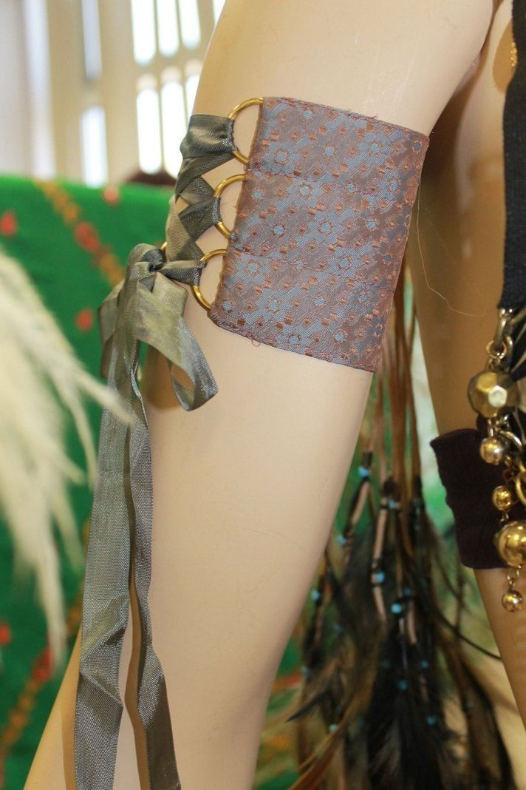
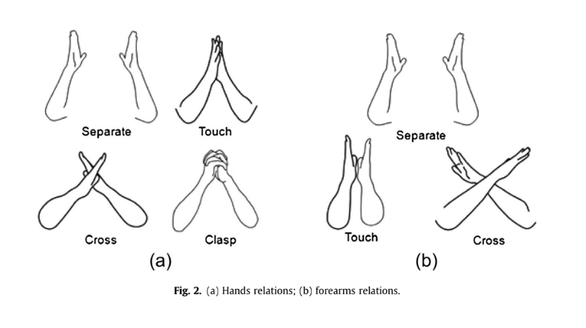

# ☀︎⋆.ೃ࿔ obra cym ⋆⁺𖤓⋆

(en proceso)

## Solar ☀︎

Combinación de la tecnología con la sostenibilidad y la utopía ecológica.

Creatividad - cooperación - calidez

## Punk *:

posicionamiento. contracultural? DIY

_________________________________________꧁⎝ 𓆩༺✧༻𓆪 ⎠꧂__________________________________________

## **Celular**

Ente accesible. cotidiano. universal ? presente.

reagenciamiento creativo. resignificación de lo cotidiano como agente de creación .
**universo invisible**: sensores, parlantes, linterna y micrófonos-laten silenciosos

reflexión sobre la relación con los dispositivos y lxs cuerpos: aparato de consumo/ herramienta fría vs. prótesis poética y política

## **Etapas**

1. Asunción del celular como parte de la experiencia cotidiana, corporal.

EXISTE- Su presencia constante configura espacio, conexiones con otrxs y cómo se median emociones y atenciones. **ya forma parte de nuestra vida y de nuestra percepción!!!!!!!!!!!!!**

(texto ia)
*We Have Never Been Modern* (1991) Bruno Latour. 
lo que damos por cotidiano: el simple hecho de sostener, encender o mover un celular, es en realidad un acto de interacción con una extensión tecnológica de nuestro cuerpo. El dispositivo, a través de sus sensores, altavoces, linterna y capacidades hápticas, responde y modifica nuestra manera de percibir: nuestra atención se dirige, nuestro ritmo se ajusta, nuestra experiencia del espacio se reorganiza. 

.2. Reagenciar su uso, cuestionar, apropiarnos y resignificar nuestra relación con la tecnología.

Pensar el dispositivo desde 3 ejes.potencias invisibles.: luz, sonido, vibración. (t.ia)como signos y resonancias, elementos que permiten una comunicación sensorial expandida

____________________________________________________________________________________________________

(t. ia)

La obra utiliza **celulares como instrumentos performáticos**, transformando objetos cotidianos en mediadores de luz, sonido y vibración. Cada dispositivo, en manos del performer o del público, responde a **gestos y movimientos**, activando linterna, parlantes y sensores, y generando un **paisaje sensorial compartido** que conecta cuerpo, espacio y comunidad.

Los celulares, objetos familiares y subestimados, dejan de ser aparatos pasivos y se vuelven **extensiones del cuerpo**, amplificando gestos y proyectando sensaciones en el entorno. Cada movimiento desencadena una respuesta del dispositivo: un parpadeo que ilumina el espacio, un pulso que vibra en la palma de la mano, un sonido que reverbera en el aire.

El público se convierte en co-creador: al sostener, mover o acercar los celulares, participa activamente en la **coreografía de luz y sonido**, generando ritmos y patrones que transforman el espacio. La obra propone así una **experiencia colectiva**, donde lo individual y lo compartido se entrelazan, y donde los dispositivos dejan de ser meros objetos tecnológicos para convertirse en **vehículos de percepción expandida y sensibilidad compartida**.

___________________________________________________________________________________________________

## **Obra**

Alternancia entre momentos guíados - momento abierto de improvisación colectiva.

Partitura expandida instructiva - abierta ( t. ia: conceptualizada por compositores experimentales de mediados del siglo XX y analizada por Umberto Eco en *Opera aperta* (1962).)

partitura como cartografía sensible . umbral hacia una experiencia colectiva de la escucha - visión - movimiento. texto poético, evocaciones, gestos mínimos, preguntas.

Intérpretes: todxs , co-creadores de la obra (t. ia: redistribuir el poder de la creación, modela relaciones sociales dentro de la performance)

## **Antecedentes musicales**

Christian Wolff 

Pauline Oliveiros -  Deep Listening

Cornelius cardew ?¡*

 

## **Antecedentes multimodales?**

? googliar

## otros antecedentes

[https://www.youtube.com/watch?v=sbiqDufLCDY](https://www.youtube.com/watch?v=sbiqDufLCDY)

[https://www.youtube.com/watch?v=Ua3PDDWwOcs](https://www.youtube.com/watch?v=Ua3PDDWwOcs)

[https://www.youtube.com/watch?v=ADEHmkL3HBg](https://www.youtube.com/watch?v=ADEHmkL3HBg)

[https://github.com/polifonia-project/deep-listening](https://github.com/polifonia-project/deep-listening)

[https://www.youtube.com/watch?v=LGMgzHdjhhI](https://www.youtube.com/watch?v=LGMgzHdjhhI)

[https://www.youtube.com/watch?v=6X29OjcBHG8&list=PLAEBD630ACCB6AD45](https://www.youtube.com/watch?v=6X29OjcBHG8&list=PLAEBD630ACCB6AD45)

https://www.youtube.com/watch?v=_Gfd7M3fi0U

Novedad¡
combinación de

Multimodal + improvisación + accesibilidad 

_________________________________________꧁⎝ 𓆩༺✧༻𓆪 ⎠꧂__________________________________________

Triangulación entre **escucha profunda (Oliveros)**, **pensamiento espacial y corporal (Forsythe)** y **morfogénesis visual digital (Gremmler).**

:::::

Objetivos

- Crear en grupo.
- Incentivar una comunicación no verbal a través del movimiento de los cuerpos e intensificada a partir del sonido y de la luz.
- Brindar instrucciones como disparadores para realizar la creación de manera consciente.

Objetivos secundarios

- Invitación a toda persona a ser parte, no se requieren conocimientos previos.
- Incentivar a crear de manera colectiva y hacer uso de las herramientas cotidianas como medios para lograrlo.

Fundamentación

Cuerpo, sonido, y luz convergen en ser materia. Su energía cinética permite pensarla en distintos estados. 

El celular opera como mediador físico de esas energías: traduce desplazamientos en vibraciones, gestos en sonido, proximidades en luminosidad.

Cada cuerpo conectado introduce una variación, un pequeño flujo de energía que reconfigura el conjunto.

:::::

Captación del movimiento.

**Acelerómetro**

Sensor que mide el movimiento y la aceleración lineal y angular en tres ejes (X, Y, Z). Funciona a través de un chip interno con una parte móvil que se desplaza con los cambios de aceleración y una parte fija que interpreta este movimiento como una señal eléctrica para determinar la posición y el movimiento del teléfono. 

Detecta: 

- Cambio de movimiento (aceleraciones)
- Orientación del dispositivo (horizontal o vertical)

Giroscopio 

Sensor que mide la orientación del dispositivo, 

Mide la velocidad de rotación y la orientación del dispositivo en un espacio tridimensional que crea.

Detecta

- Orientación del dispositivo absoluta (ejes x, y, z) Y rotación (alpha, beta, gama)

Trabaja junto con el Acelerómetro.

::

Prototipo de sostén del dispositivo

Crear funda tipo bolsillo con nilon cristal transparente, menos compleja.

[https://www.youtube.com/watch?time_continue=6&v=k66xVWmp1l4&embeds_referring_euri=https%3A%2F%2Far.pinterest.com%2F](https://www.youtube.com/watch?time_continue=6&v=k66xVWmp1l4&embeds_referring_euri=https%3A%2F%2Far.pinterest.com%2F)

::

::

Escritura.

Ref. **Choi, Kim, Chung_2014_A taxonomy and notation method for three-dimensional hand gestures.** 

[https://drive.google.com/file/d/1qR30B0UNoQsWS8Z5DWTtN_yvvGVqLVYW/view?usp=sharing](https://drive.google.com/file/d/1qR30B0UNoQsWS8Z5DWTtN_yvvGVqLVYW/view?usp=sharing)

Puntos en el espacio.

Imaginar lineas.

Ejes: X, Y, Z.

## **Primera parte**

**Preparación**

Estar de pie o sentadx, con el brazo libre.

Percibir la respiración.

---

**Dirección**

Localizar una línea imaginaria entre el codo y la mano.

Esa línea puede orientarse en cualquier eje del espacio:

horizontal (X), vertical (Y) o de profundidad (Z).

Imaginar dos puntos en el espacio.

El movimiento entre esos puntos puede ser **lineal** —en los ejes horizontal o vertical—,

o **curvo**, desplazándose en los ejes vertical o de profundidad.

Repetir hasta tres veces, si la atención se sostiene.

---

## **Segunda parte**

**Profundidad**

Imaginar puntos muy cercanos entre sí.

Imaginar un punto adelante y otro detrás del cuerpo.

Imaginar puntos muy lejanos entre sí.

---

**Velocidad**

Explorar distintas velocidades.

Moverse entre puntos de la manera más rápida posible.

Moverse entre puntos de la manera más lenta posible.

Alternar entre ambas.

---

**Escucha**

Escuchar antes de moverse.

Escuchar durante el movimiento.

Escuchar después.

Si no hay nada que escuchar, esperar.

---

## **Tercera parte**

**Observación**

Observar un movimiento antes de moverse.

Si no hay nada que observar, iniciar el movimiento.

Imitar el movimiento.

Acelerar el movimiento.

Realizar el movimiento lo más lento posible.

---

**Cierre**

Detener el movimiento cuando se disuelva la atención.

Volver a la respiración.