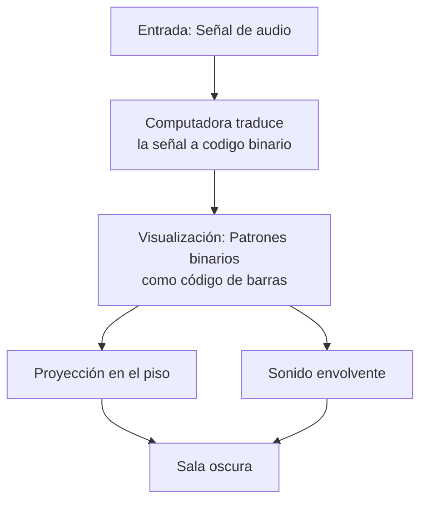

Título: La Transducción Binaria como Paradigma Operativo en "Test Pattern" de Ryoji Ikeda

Modelar un fenómeno o concepto en un paradigma operativo.
Implementarlo en un entorno algorítmico (código, simulación, dispositivo).
Materializarlo en un objeto o experiencia artística.

---

### Consigna
- Identificar en obras referenciales qué paradigma operativo subyace.
- Definir el paradigma operativo 
### Filosóficamente:
- Enuncia la intuición fundante en un lenguaje especulativo sin necesariamente un soporte empírico. (ej: la realimentación modula la agencia del performer hasta convertirlo en interfaz)
### Matemáticamente:
- Traducir a una fórmula lógica, matemática o de diagrama de flujo. 
puede incluir pseudocódigo, fórmulas, representaciones simbólicas (mermaid, UML, Spencer-Brown).
aquí se define la operación matricial del paradigma.

### Demostración experimental: 
- Aislar su funcionamiento en una demostración / sonificación / visualización interactiva.
- Diseñar una micro-obra en 7 días partiendo de un único paradigma operativo elegido.
### Reflexión: 
registrar cómo interactuaron intuición y razón en el proceso en un texto de 600-2000 palabras en latex. 
Debe contener como germen el modelo de producción de un paper científico:

introducción (incluye la literatura revisada o estado del arte)
metodología (matriz elegida)
demostración, conclusiones, crítica, refutación.
referencias en bibtex.

- Identificar en obras referenciales qué paradigma operativo subyace.

