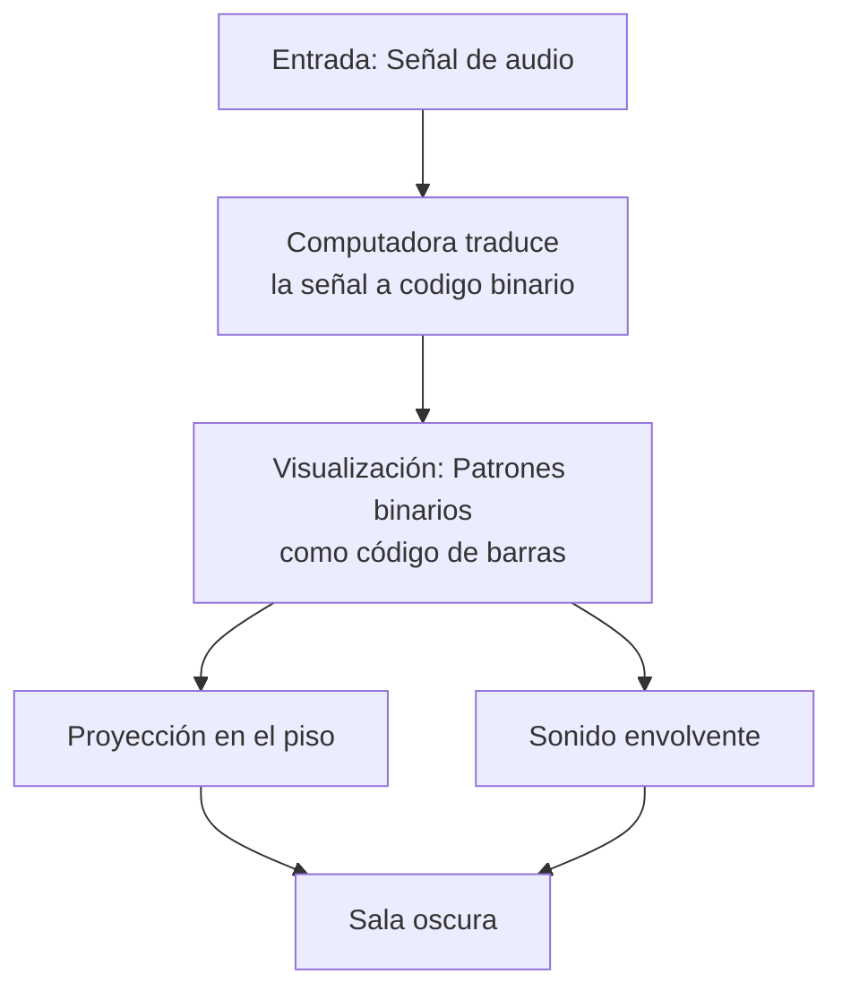

Título: La Transducción Binaria como Paradigma Operativo en "Test Pattern" de Ryoji Ikeda

Modelar un fenómeno o concepto en un paradigma operativo.
Implementarlo en un entorno algorítmico (código, simulación, dispositivo).
Materializarlo en un objeto o experiencia artística.

---

Consigna.
- identificar en obras referenciales qué paradigma operativo subyace.
- Definir el paradigma operativo 
### filosóficamente:
enuncia la intuición fundante en un lenguaje especulativo sin necesariamente un soporte empírico. (ej: la realimentación modula la agencia del performer hasta convertirlo en interfaz)
### matemáticamente:
traducir a una fórmula lógica, matemática o de diagrama de flujo. 
puede incluir pseudocódigo, fórmulas, representaciones simbólicas (mermaid, UML, Spencer-Brown).
aquí se define la operación matricial del paradigma.
Demostración experimental: 
Aislar su funcionamiento en una demostración / sonificación / visualización interactiva.
Diseñar una micro-obra en 7 días partiendo de un único paradigma operativo elegido.
Reflexión: registrar cómo interactuaron intuición y razón en el proceso en un texto de 600-2000 palabras en latex. 
Debe contener como germen el modelo de producción de un paper científico
introducción (incluye la literatura revisada o estado del arte)
metodología (matriz elegida)
demostración,
conclusiones, crítica, refutación.
referencias en bibtex.

1. Modelar un fenómeno o concepto en un paradigma operativo.
El fenómeno modelado es el umbral de legibilidad digital. El paradigma operativo es la transducción por umbral binario: un proceso que convierte cualquier señal analógica continua en una representación discreta de dos estados absolutos (1/0, blanco/negro, sí/no) mediante la aplicación brutal de un umbral crítico.

2. Implementarlo en un entorno algorítmico.
Se implementó en TouchDesigner replicando el núcleo del sistema de Ikeda:

Input: Datos de audio o archivos.

Proceso: Conversión de la señal a valores numéricos → aplicación de un umbral (nodo Threshold TOP) → decisión binaria para cada valor.

Output: Patrón visual en blanco y negro que es la representación directa y cruda de los datos de entrada.

3. Materializarlo en un objeto o experiencia artística.
La materialización se realiza a través de:

Experiencia digital: La visualización en TouchDesigner, donde se observa en tiempo real la conversión de datos en patrones binarios.

Experiencia física (propuesta): La pintura de un fotograma del proceso en un lienzo, aplicando capas de blanco y negro según la decisión binaria del algoritmo, trasladando el paradigma digital al acto manual de pintar.

4. Paradigma operativo subyacente.
El paradigma es la codificación binaria por umbral (\mat_{analógico} \threshold_{\tau} \mat_{binario}), que opera bajo la intuición filosófica de que toda experiencia continua puede y debe ser reducida a una secuencia de instrucciones elementales discretas, revelando la infraestructura invisible de la digitalización.

5. Interacción intuición-razón.
El proceso creativo comenzó con la intuición estética de la obra de Ikeda (lo abrumador, lo digital puro) y requirió la racionalización mediante la identificación de su operación matricial fundamental: la función de umbral. La implementación técnica (razón) permitió materializar la intuición artística inicial.

