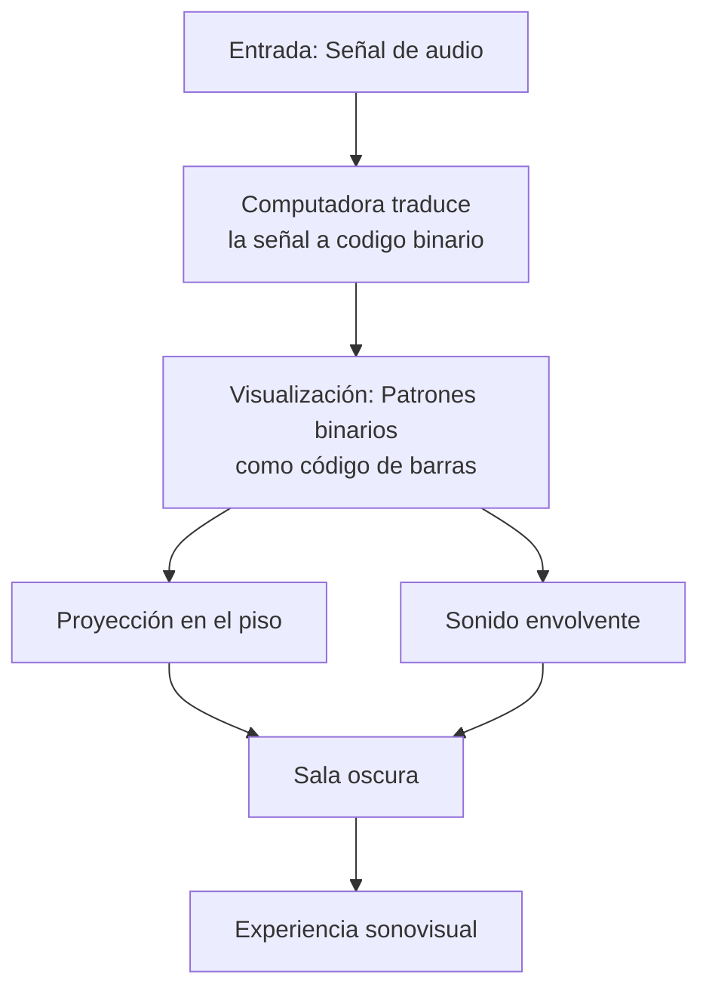

```mermaid
flowchart TD
    A[Entrada: Señal de audio] --> B[Computadora traduce<br/> la señal a codigo binario]
    
    B --> C[Visualización: Patrones binarios<br/>como código de barras]
    
    C --> E[Proyección en el piso]
    C --> F[Sonido envolvente]
    E --> g
    F --> g
    g[Sala oscura]
    
    g --> I[Experiencia sonovisual]
```
