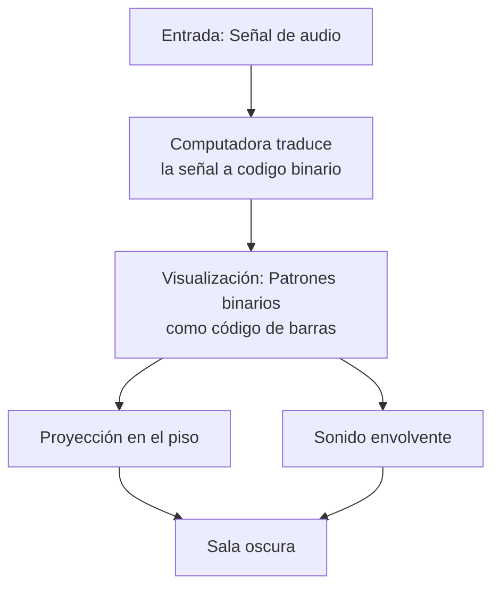

## La traducción binaria como paradigma operativo en "Test Pattern" de Ryoji Ikeda

- Modelar un fenómeno o concepto en un paradigma operativo.
- Implementarlo en un entorno algorítmico (código, simulación, dispositivo).
- Materializarlo en un objeto o experiencia artística.

---

#### Consigna
- Identificar en obras referenciales qué paradigma operativo subyace.
- Definir el paradigma operativo 
#### Filosóficamente:
- Enuncia la intuición fundante en un lenguaje especulativo sin necesariamente un soporte empírico. (ej: la realimentación modula la agencia del performer hasta convertirlo en interfaz)
#### Matemáticamente:
- Traducir a una fórmula lógica, matemática o de diagrama de flujo. 
  puede incluir pseudocódigo, fórmulas, representaciones simbólicas (mermaid, UML, Spencer-Brown).
  aquí se define la operación matricial del paradigma.

#### Demostración experimental: 
- Aislar su funcionamiento en una demostración / sonificación / visualización interactiva.
- Diseñar una micro-obra en 7 días partiendo de un único paradigma operativo elegido.
#### Reflexión: 
- Registrar cómo interactuaron intuición y razón en el proceso en un texto de 600-2000 palabras en latex. 
Debe contener como germen el modelo de producción de un paper científico:

introducción (incluye la literatura revisada o estado del arte)
metodología (matriz elegida)
demostración, conclusiones, crítica, refutación.
referencias en bibtex.

---

- Identificar en obras referenciales qué paradigma operativo subyace.
  Obra referencial: "Test Pattern" de Ryoji Ikeda (2008)
  Paradigma operativo subyacente: Visualización de audio.

- Definir el paradigma operativo 
  Traduce directamente datos de audio en patrones de luz binarios usando algoritmos mediante un programa corriendo en una computadora. Los "1" representan sonidos/luz, los "0" representan silencio/oscuridad. Hace por una parte una abstracción umbralizando binariamente los datos de input para representarlos como algo visual y por otra reproduce esos datos como frecuencias sonoras. Ambas partes son puestas en común en una sala oscura.
  
- Enuncia la intuición fundante en un lenguaje especulativo sin necesariamente un soporte empírico.
  La intuición fundante especula que el sonido y la luz comparten o tienen datos en común. "Test Pattern" descifra y revela esta especie de lenguaje oculto, traduciendo lo audible en un espacio oscuro en el que el espectador ve una representación de esos datos visualizándolos de una manera única.
  
- Traducir a una fórmula lógica, matemática o de diagrama de flujo.

- Aislar su funcionamiento en una demostración / sonificación / visualización interactiva.
- Diseñar una micro-obra en 7 días partiendo de un único paradigma operativo elegido.
  
  ![[TP01 Paradigmas operativos Tomás Fernandez_1.mp4]]

- Reflexión: la interacción entre intuición y razón en el proceso.
  
  ##### Introducción
Mi trabajo se basó en analizar "Test Pattern" de Ryoji Ikeda, una obra que sigue el paradigma de visualización de audio. Esta obra me interesó porque convierte datos sonoros en patrones visuales de manera directa, sistemática y utilizando abstracciones, entre otras diferentes técnicas.

  #### Metodología
  La metodología seleccionada para este proyecto combinó principios del diseño especulativo con el método de investigación-creación. Este enfoque híbrido permitió: 
  Fase Intuitiva: Exploración libre de conexiones sensoriales entre sonido y visión sin restricciones técnicas iniciales
  Fase Racional: Implementación técnica en TouchDesigner siguiendo principios de programación modular
  Fase Integrativa: Iteraciones donde la retroalimentación entre resultado visual y expectativa intuitiva refinó el sistema
  Registro del desarrollo técnico de las iteraciones sonoro-visuales producidas:
  ![[Pasted image 20250910023437.png]]
  
  #### Demostración
  La implementación técnica en TouchDesigner materializó la intuición fundante, esto demostró, cómo un concepto abstracto puede traducirse en un sistema concreto mediante herramientas digitales. La micro-obra resultante evidenció que es posible crear una experiencia inmersiva donde los espectadores perciben simultáneamente los datos sonoros procesados digitalmente como entidades audibles y visibles.
  
  #### Conclusiones
  Encontré que la intuición inicial sobre la relación sonido-luz se validó técnicamente. La parte racional en TouchDesigner me permitió materializar la idea conceptual. Ambas facetas fueron necesarias: la intuición para la visión artística y la razón para la ejecución técnica.
  
  #### Crítica y Refutación
  Una posible objeción a este modelo radica en su aparente privilegio de lo técnico sobre lo conceptual. ¿Se convierte el artista en mero implementador de sistemas predefinidos? Mi experiencia refuta esta crítica: las limitaciones técnicas actuaron como catalizadores creativos, generando soluciones inesperadas que enriquecieron el concepto inicial. La razón técnica no restringió la intuición sino que le proporcionó un campo de juego con reglas productivas.
  
  #### Referencias
  Ikeda, R. (2022). Test pattern 100m version, 2013. In ryoji ikeda studio. https://www.youtube.com/watch?v=RZ-dLYmoGW4
  Ikeda, R. (2008). ryoji ikeda. Test Pattern. https://www.ryojiikeda.com/project/testpattern/
