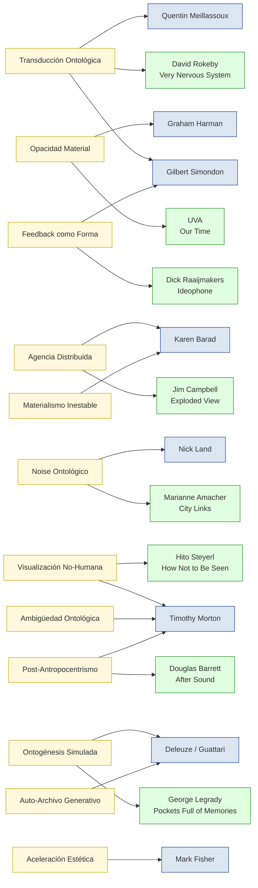

# procedimientos de la historia del arte

1. Metaforización
- Transformación de un campo semántico en otro, mediante analogía o desplazamiento simbólico.
- Referencias: Paul Ricoeur (La metáfora viva), Gaston Bachelard.

2. Alegoría
- Encadenamiento simbólico donde cada elemento remite a un sistema interpretativo externo.
- Referencias: Walter Benjamin (El origen del drama barroco alemán), Craig Owens.

3. Extrañamiento (Ostranenie)
- Hacer ver como por primera vez, desautomatizar la percepción.
- Referencias: Viktor Shklovsky, formalismo ruso.

4. Desplazamiento
- Movimiento semántico o espacial de elementos fuera de su contexto original.
- Referencias: Sigmund Freud (en lo onírico), Roland Barthes (en lo fotográfico).

5. Condensación
- Superposición de múltiples significados en una sola imagen o forma.
- Referencias: Freud, Lacan (retóricas del inconsciente).

6. Ironía
- Distancia entre lo dicho y lo querido decir, con o sin tono humorístico.
- Referencias: Søren Kierkegaard, Paul de Man.

7. Parodia / Pastiche
- Citas, apropiaciones o imitaciones con carga crítica (parodia) o vaciada (pastiche).
- Referencias: Linda Hutcheon, Fredric Jameson.

8. Simulacro
- Imitación sin original, o disolución de la distinción entre realidad y representación.
- Referencias: Jean Baudrillard.

9. Transposición
- Paso de una forma artística a otra (por ejemplo, novela a cine, o pintura a música).
- Referencias: Gérard Genette (transtextualidad).

10. Descontextualización / Recontextualización
- Separación de un signo de su entorno original y su inserción en un nuevo marco.
- Clave en arte conceptual, Duchamp, Dadaísmo, arte de archivo.

11. Anacronismo
- Uso deliberado de elementos fuera de su tiempo histórico.
- Referencias: Georges Didi-Huberman (Ante el tiempo), Aby Warburg (Mnemosyne).

12. Fragmentación
- Discontinuidad formal o narrativa como principio estructural.
- Referencias: Modernismo, postmodernismo, Deleuze (rizoma).

13. Silencio / Elipsis
- Omisión estratégica para generar sentido desde la ausencia.
- Referencias: John Cage, Derrida (différance), Beckett.

14. Mímesis crítica
- Representación no como copia sino como deformación activa.
- Referencias: Adorno, Jacques Rancière.

15. Autorreferencia / Metatextualidad
- Obras que se comentan a sí mismas o a sus propias condiciones de producción.
- Referencias: Genette, Foucault (Qué es un autor), Borges.

16. Iteración / Repetición con diferencia
- Repetición no como redundancia, sino como producción de novedad.
- Referencias: Deleuze (Diferencia y repetición), Steve Reich.

17. Cripsis / Opacidad deliberada
- Ocultamiento o codificación para impedir la interpretación directa.
- Referencias: Édouard Glissant (Poética de la Relación), artistas afrodiaspóricos.

18. Superposición / Palimpsesto
- Capas visibles de sentido que se acumulan sin borrar lo anterior.
- Referencias: Thomas De Quincey, Giuliana Bruno.

19. Desidentificación
- Estrategia de ruptura con identidades fijas o normativas.
- Referencias: José Esteban Muñoz, Judith Butler.

20. Noise / Ruido como semiosis
- El uso de lo aparentemente ininteligible como portador de sentido.
- Referencias: Jacques Attali (Ruidos), Pauline Oliveros.

# del arte electrónico e interactivo 

Excelente enfoque. A continuación, te presento una lista ampliada de operaciones artísticas y estéticas que han sido fundamentales en la historia del arte electrónico, tecnológico e interactivo desde el siglo XIX hasta el XXI. Cada una está situada dentro de marcos filosófico-estéticos contemporáneos, especialmente del realismo especulativo, ontología orientada a objetos, aceleracionismo y otras corrientes del siglo XXI. Incluyo referentes clave para cada operación:

- 

1. Transducción Ontológica
- Transformar energía, datos o materia en experiencia sensible, sin reducirlo al sujeto.
- Inspirado en: Gilbert Simondon, Meillassoux (no correlacionismo), Barad (intra-acción).
- Ejemplo: David Rokeby, Very Nervous System — movimiento traducido a sonido.
- Operación: transformar la ontología en interacción sin mediación psicológica.

- 

2. Opacidad Material
- Dejar hablar a la materia o al sistema sin explicarlo, asumir su autonomía operativa.
- Inspirado en: Graham Harman, Édouard Glissant (opacidad), Morton (objetos hiperbólicos).
- Ejemplo: UVA, instalaciones donde el código y la luz no tienen narrativa pero generan mundo.
- Operación: producir fenómenos que no se agotan en la interpretación.

- 

3. Agencia Distribuida
- Delegar decisiones estéticas a sensores, algoritmos, objetos o sistemas híbridos.
- Inspirado en: Bruno Latour, Barad, Bogost (Alien Phenomenology).
- Ejemplo: Jim Campbell, instalaciones LED donde la imagen emerge del comportamiento sistémico.
- Operación: descentrar al artista como sujeto de control.

- 

4. Noise Ontológico / Ruidismo Epistémico
- Usar el ruido no como falla sino como lo real que escapa a la forma.
- Inspirado en: Nick Land, Fisher, Pauline Oliveros.
- Ejemplo: Marianne Amacher, City Links — feedback arquitectónico.
- Operación: dejar que el sistema se autointerfiera y muestre su inestabilidad.

- 

5. Visualización No-Humana
- Mostrar cómo vería un sistema, máquina o ente no-humano.
- Inspirado en: Object-Oriented Ontology, Morton, Vilem Flusser.
- Ejemplo: Hito Steyerl, How Not to be Seen — crítica desde la perspectiva del píxel.
- Operación: simular una mirada inasimilable por el sujeto.

- 

6. Feedback como Forma
- Usar el bucle retroactivo como material compositivo, más allá del control.
- Inspirado en: Cibernética de segundo orden, Raaijmakers, Esferas de Sloterdijk.
- Ejemplo: Dick Raaijmakers, Ideophone I — retroalimentación entre voz y máquina.
- Operación: dejar que el sistema se pliegue sobre sí.

7. Ontogénesis Simulada
- Sistemas que no representan sino que devienen otros, mutan, crecen, colapsan.
- Inspirado en: Simondon, Deleuze, acceleracionismo suave.
- Ejemplo: George Legrady, Pockets Full of Memories — base de datos que se transforma.
- Operación: modelar sistemas como entidades con biografía virtual.

8. Aceleración Estética / Exceso Cognitivo
- Saturación de información, simultaneidad, estímulo sensorial que rebasa la percepción.
- Inspirado en: Mark Fisher, Land, CCRU, Luhmann.
- Ejemplo: Ars Electronica, experiencias inmersivas en múltiples canales sensoriales.
- Operación: empujar al sistema perceptual más allá de lo decodificable.

- 

9. Materialismo Inestable / Temporalidad Fluida
- Jugar con los estados transitorios de los materiales (luz, vapor, datos en tránsito).
- Inspirado en: Karen Barad, Tim Ingold, Morton.
- Ejemplo: instalaciones con niebla, laser, LED, agua controlada por código.
- Operación: usar materiales que son procesos.

1. Post-Antropocentrismo Escénico
- Escenas donde lo humano es solo un nodo, no centro.
- Inspirado en: Timothy Morton, Donna Haraway, Sloterdijk.
- Ejemplo: Douglas Barrett, After Sound — performances que descentran lo humano.
- Operación: componer una escena en red, sin foco.

11. Auto-Archivos Generativos
- Obras que se reescriben, reordenan o expanden según condiciones internas.
- Inspirado en: Deleuze, informática crítica, auto-poiesis.
- Ejemplo: Legrady, sistemas que se nutren de bases de datos para generar nuevos outputs.
- Operación: la obra es un archivo que se muta a sí mismo.

12. Ambigüedad Ontológica / Hiperobjetos
- Artefactos cuya escala o comportamiento los vuelve inabarcables (como el cambio climático).
- Inspirado en: Morton, Harman, Object-Oriented Ontology. Meillassoux -> hyperfossil
- Ejemplo: instalaciones interactivas cuya lógica nunca se termina de entender.
- Operación: hacer de la obra un fenómeno indeterminado.

