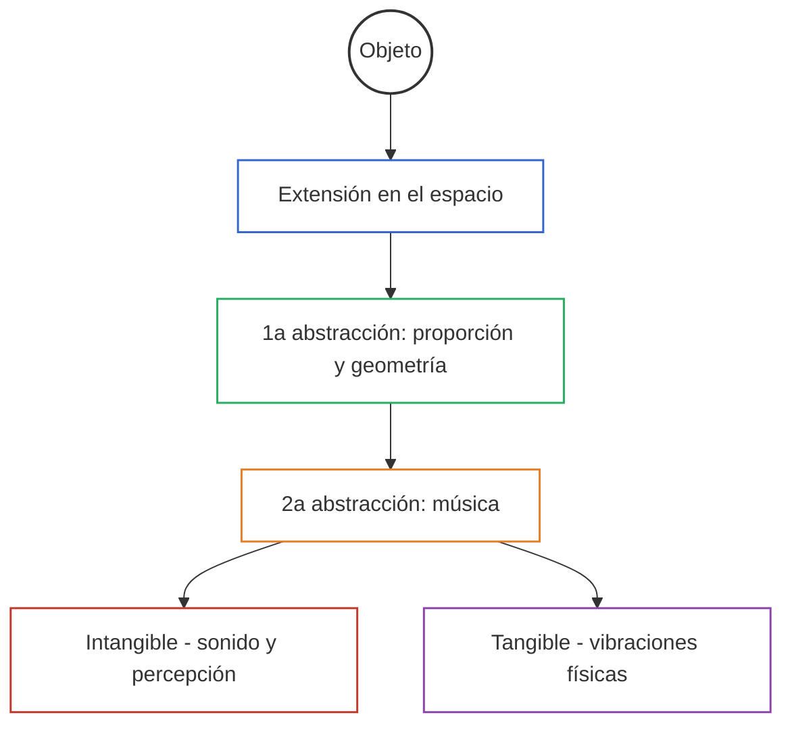
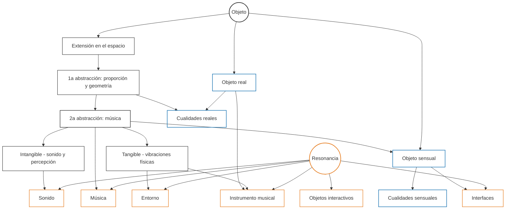

<grid drag="60 55" drop="5 10" bg="black" align="left">
# Ciencia y Música
## introducción
#### Clase 1
</grid>
<grid drag="-5 10" drop="5 -10" bg="black">
![[cym-header]]
</grid>

<grid drag="25 55" drop="-5 10" bg="black" align="top">
-> metodologías 
-> procedimientos operativos 
-> escritura icónica 
-> energía 
</grid>

---
# espectactivas

---
##  la clase de cym es **modular**. No es una clase expositiva unicamente, sino que se trazan mapas , módulos y referencias por donde construir un proyecto pero también un contexto. 
 
---

 - Hay que ser **generosx**! es muy importante la participación , para lo cual vamos a usar ***discord***, y el método de [[amigo crítico]] Allí podrán compartir sus proyectos, pero también es muy importante comentar los posteos de lxs compañerxs (elogiar, criticar, compartir referencias o ideas).

---
# objetivos

---
1.  pensar y crear el futuro de la música.

---
2.  Crear proyectos musicales significativos dentro del campo expandido y los paradigmas de ciencia y arte.

---
3.  diseñar patrones metacognitivos y metamusicales a la acción musical 

-> **Paradigmas operativos**

---

4.  comprender las bases del pensamiento científico y su relación con la creación artística.

---

5. Incorporar paradigmas de pensamiento y análisis que habitan la filosofía general de la ciencia en los diferentes períodos históricos.

---

6. Generar la capacidad de plantear un constructo epistemológico como matriz del pensamiento estético y proyectar a partir de herramientas a la creación de una obra artística, un instrumento o un trabajo teórico.

---
## que es la música?

- la música es sonido organizado [Varese]

-  orden, combinación de tonos con relaciones temporales de unidad y continuidad [Webster]

- el arte de combinar velocidades [zztt]

---

- la configuración de una abstracción en el espacio. La proporción de un objeto que se extiende en el espacio.  [Ligeti]

note: configuración de una abstracción en el espacio , en el sentido de que es la proporción de un objeto que se extiende en un espacio, entonces vendria a ser la abstracción de una abstracción. Esto nos permite unir la música con objetos intangibles, pero también tangibles y unir percepciones para que la música no solo represente sonido en el tiempo sino vibraciones en el tiempo .

---

---

La Ontología Orientada a Objetos (**OOO**), propuesta por *Graham Harman*, plantea que todos los objetos —tanto humanos como no humanos, reales o ficticios— poseen la misma dignidad ontológica.  
La teoría critica la tendencia filosófica a reducir los objetos a sus relaciones, funciones o percepciones.  

note:
OOO surge dentro del movimiento del realismo especulativo (2007 en adelante). Harman busca superar el “correlacionismo” (la idea de que solo conocemos la relación entre pensamiento y mundo) y propone que los objetos poseen existencia autónoma más allá de nuestras percepciones.  
Para explicar esa autonomía distingue **cuatro tipos de objetos**: objeto real (lo que nunca se agota en la experiencia), objeto sensual (lo que aparece en la experiencia), cualidades reales (atributos del objeto que permanecen ocultos) y cualidades sensuales (atributos que aparecen en la experiencia).  
Esto permite pensar una ecología de entidades —desde partículas subatómicas hasta ficciones literarias— donde cada objeto interactúa parcialmente con otros, nunca agotándose.  
En el marco de la música y la organología, esta perspectiva habilita concebir instrumentos, sonidos, performers y entornos como objetos con agencia propia, conectados por resonancias parciales, sin reducirlos a simples medios o efectos.  

---

## Los cuatro objetos de Harman

- **Objeto real (OR)**: existe más allá de la percepción o el uso.  
- **Objeto sensual (OS)**: la manera en que aparece en la experiencia.  
- **Cualidades reales (CR)**: propiedades que permanecen ocultas, inaccesibles.  
- **Cualidades sensuales (CS)**: propiedades manifiestas en la percepción. 

<ref>Harman, G. (2016). Object-Oriented Ontology. Urn:Isbn:9780241269152.<ref>

note:
La interacción entre estos cuatro polos se da a través de lo que Harman llama **retiro del objeto**: ningún objeto puede ser agotado por otro, siempre queda un resto.  
Ejemplo musical:  
- Un violín como OR es más que la suma de sus usos o su percepción.  
- Como OS, aparece al oyente en el escenario.  
- Sus CR incluyen propiedades físicas y resonantes que nunca se experimentan completamente.  
- Sus CS incluyen el timbre y la textura que se perciben en una interpretación.  

---

---

> [!tip] **Ianni Xenakis** Formalized Music
>Es una especie de comportamiento necesario para quien la piensa y la hace. Es un pleroma individual, una realización. Es una fijación en el sonido de virtualidades imaginadas (argumentos cosmológicos, filosóficos, ...,) Es normativo, es decir, inconscientemente es un modelo para ser o para hacer por pulsión simpática. Es catalizador: su mera presencia permite transformaciones psíquicas o mentales internas del mismo modo que la bola de cristal del hipnotizador. Es el juego gratuito de un niño. Es una ascesis mística (pero atea). En consecuencia, las expresiones de tristeza, alegría, amor y situaciones dramáticas son sólo instancias particulares muy limitadas.

---

En el auge de la reproducción técnica de la música **Varese** abstrae su función y se concentra en diseñar sonido mas que escribir para la gestualidad del músico.

---

# ciencia 

---
## cosmovisiones míticas y pre-filosóficas

- orden del cosmos observable traducido a relatos sagrados y correspondencias simbólicas.

note: universo babilónico, como muestra esta imagen, se estructura en esferas concéntricas y simétricas que rodean a una tierra central con forma de zigurat. Cada esfera representa un cielo asociado a una deidad planetaria, configurando una cosmología jerárquica y astronómicamente organizada, precursora de los modelos posteriores de esferas celestes en Grecia y la astronomía medieval.

---

##  Nacimiento de la filosofía natural (Grecia presocrática)
   - Con los jonios (Tales, Anaximandro, Heráclito), aparece la idea de que el mundo puede explicarse mediante principios racionales, no míticos.
   - Se introducen conceptos como *arché* (principio originario), *physis* (naturaleza) y *logos* (razón).
   - La matemática comienza a ser vista como forma pura de conocimiento (Pitágoras), anticipando la abstracción formal de la ciencia posterior.
---

## universo pitagórico  (-570 -495)

note:La imagen del universo pitagórico muestra un modelo de esferas armónicas donde los astros giran en órbitas concéntricas alrededor de la Tierra, cada una asociada a un intervalo musical, reflejando la idea de la música de las esferas. Este modelo evoluciona hacia el universo aristotélico al integrar no solo la estructura concéntrica, sino también una ontología física basada en los cuatro elementos, el éter y la causalidad, abandonando parcialmente el carácter místico y numérico de los pitagóricos en favor de una cosmología naturalista y jerárquica. Ambos comparten la idea de orden, simetría y circularidad, pero el de Aristóteles incorpora la noción de movimiento natural y fin teleológico.

---

# Paradigmas operativos pitagóricos

### **Ratio (λόγος numérico)**
   - El universo es comprensible mediante relaciones numéricas simples.
   - Aparece por primera vez la noción de "ley natural" expresable como proporción (2:1, 3:2, 4:3...).
   - En música, esto se manifiesta en la entonación justa, los intervalos consonantes y la afinación racional.

---

### **Kosmos como orden (κόσμος)**
   - El mundo no es caos ni azar, sino un sistema ordenado.
   - Esta visión se plasma en la idea del *kosmos* como armonía de opuestos equilibrados.
   - Prefigura tanto la noción moderna de sistema como la idea estética de composición musical como reflejo del orden universal.

---

### **Pleroma (πλήρωμα)**
   - El todo está lleno, no hay vacío: cada cosa tiene su lugar y función en el orden cósmico.
   - Anticipa las ideas de *esferas llenas* que resonarán en la cosmología aristotélica y en las teorías musicales cerradas.
   - Implica una plenitud ontológica donde lo musical tiene una dimensión metafísica.

---

### **Matematización de lo sensible**
   - Lo sensible puede ser explicado desde lo inteligible: la cuerda vibrante, el número, la forma.
   - Esta operación inicia la tradición de abstracción que culminará en Galileo y Newton.
   - También habilita la escritura musical como sistema simbólico racional.
   
---

### **Correspondencia micro-macro**
   - "Así como es arriba, es abajo": la estructura del alma, del cuerpo y del cosmos responden a las mismas proporciones.
   - Fundamento de la idea de *analogía estructural*, clave en composición, estética y pensamiento especulativo.
   - Impulsa un pensamiento relacional, precursor de topologías y redes.

---
### **Aritmosofía / Mística del número**
   - El número no solo describe, sino que *es* la esencia de lo real.
   - El tetraktys (1+2+3+4=10) como símbolo sagrado: unidad armónica del universo.
   - Marca el inicio de un pensamiento donde *teoría* y *creencia* aún no están escindidas.

---

##  forma, causa y demostración

   - Platódamn establece una ontología dualista: mundo sensible vs mundo inteligible. La ciencia verdadera debe aspirar a lo inmutable (números, ideas).
   - Aristóteles desarrolla una **epistemología sistemática** basada en las causas (*aitia*) y en el razonamiento lógico. Propone la idea de ciencia como conocimiento demostrativo (*episteme*).

---

## modelo aristotélico de universo  (-384 -322)

note:  modelo aristotélico del universo concibe la realidad como una serie de esferas concéntricas perfectas y jerárquicas, donde la Tierra está en el centro inmóvil, rodeada por esferas cristalinas que portan los astros. Esta estructura, heredada y refinada por Ptolomeo, sienta las bases de la astronomía y la ciencia al introducir la idea de un cosmos ordenado, predecible y matemáticamente describible, aunque fundado en una metafísica de la perfección circular y del movimiento natural.

---

## movimiento retrógrado aparente (-700 1600)

note: 
Babilonios (ca. -700)
	•	Registraron movimientos planetarios, incluyendo retrogradaciones, con gran precisión.
	•	Usaban instrumentos como el gnomon y tablas astronómicas para registrar posiciones.
	2.	Griegos (Eudoxo, Apolonio, Ptolomeo)
	•	Para explicar el movimiento retrógrado, desarrollan el modelo de epiciclos y deferentes: círculos sobre círculos.
	•	El sistema culmina en el modelo geocéntrico de Ptolomeo (Almagesto, siglo II d.C.), donde cada planeta se mueve en un epiciclo cuyo centro gira sobre un deferente alrededor de la Tierra.
	3.	Copérnico (siglo XVI, ca. 1543)
	•	Propone el modelo heliocéntrico, que explica naturalmente el movimiento retrógrado como un efecto óptico debido a la diferente velocidad orbital de los planetas.
	4.	Tycho Brahe (siglo XVI, ca. 1570–1600)
	•	Con su cuadrante mural y otros instrumentos como el sextante y el armilar, realizó las mediciones más precisas a ojo desnudo del cielo hasta ese momento.
	•	Sus datos fueron fundamentales para Kepler.
	5.	Johannes Kepler (1609–1619)
	•	Gracias a las observaciones de Brahe, formuló sus tres leyes del movimiento planetario, eliminando epiciclos y proponiendo órbitas elípticas, lo que resolvió definitivamente el problema del movimiento retrógrado.

---

---

### cuadrante mural 

---

note: 	
Cuadrante mural (usado por Tycho Brahe)
Fijado a una pared orientada al meridiano, permitía medir con gran precisión la altura angular de los astros. Fue el instrumento que posibilitó los datos con los que Kepler pudo derrocar la visión circular de los epiciclos.

---

##  matematización del mundo (Helénicos, Edad Media, Renacimiento)

   - Euclides formaliza la geometría. Ptolomeo sistematiza la astronomía.
   - En el mundo islámico y luego en Europa medieval, se conserva y expande el saber clásico.
   - En el Renacimiento (Copérnico, Kepler), la observación astronómica se une con modelos matemáticos, desafiando la cosmología aristotélica.

---

## modelo elíptico de Kepler

note:
La órbita del planeta tiene forma de elipse, no de círculo.
	•	Los dos focos de la elipse están marcados; el Sol se encuentra en uno de ellos.
	•	El planeta gira alrededor del Sol recorriendo esa elipse.
	•	Perihelio: punto más cercano al Sol.
	•	Afelio: punto más lejano del Sol.
	•	El dibujo muestra cómo se puede trazar una elipse usando una cuerda tensa con dos puntos fijos: es un método geométrico simple que refleja el fundamento matemático de las órbitas planetarias.

⸻

Superación del modelo aristotélico:

La cosmología aristotélica (y ptolemaica) sostenía que:
	•	Las órbitas celestes eran circulares porque el círculo era la figura perfecta.
	•	Los movimientos eran uniformes y eternos.
	•	La Tierra estaba en el centro (modelo geocéntrico).

Kepler rompe con esto al:
	1.	Abandonar la circularidad: sustituye el dogma del círculo perfecto por la elipse, una figura matemática más precisa, basada en la observación.
	2.	Descentrar el Sol: el Sol no está en el centro de la órbita, sino en un foco. Este desplazamiento simbólico del centro tiene profundas implicancias filosóficas.
	3.	Matematizar el movimiento: Kepler introduce modelos cuantitativos y dinámicos, ya no basados en la perfección platónica sino en la regularidad observacional (gracias a los datos de Tycho Brahe).
	4.	Inaugurar la física celeste: sus leyes, especialmente la tercera, anticipan el vínculo entre geometría y fuerza que luego Newton formalizará como ley de gravitación.

---

## Revolución científica y método moderno 
   - Con Galileo, Descartes, Newton, nace la ciencia moderna: una forma de conocimiento basada en la observación controlada, la cuantificación y la deducción matemática.
   - Se consolida la idea de *método científico*: combinación de experiencia (inductiva) y razón (deductiva), con posibilidad de verificación y falsación.

---

## **Consolidación y crisis del paradigma clásico**
   - En los siglos XVIII–XIX, la física clásica, la química moderna y la biología evolucionista (Darwin) establecen grandes teorías de amplio alcance.
   - Pero a fines del siglo XIX surgen límites y anomalías que dan lugar a nuevos paradigmas: relatividad (Einstein), mecánica cuántica, genética molecular, etc.
---

## modelo de universo angélico (1225-1274, Santo Tomás)

note:
cosmología medieval cristiana donde el universo está regido por esferas concéntricas movidas por inteligencias angélicas, según la teología de Santo Tomás de Aquino (siglo XIII, ca. 1225–1274), quien retoma y cristianiza el modelo aristotélico-ptolemaico. Cada esfera celeste es impulsada por un ángel, culminando en el Motor Inmóvil (Dios), en un sistema que une astronomía, metafísica y jerarquía espiritual.
1. **Causalidad jerárquica**
   - El movimiento de los cuerpos no es mecánico, sino producido por inteligencias superiores.
   - Las esferas son vivientes, animadas por entes no materiales: los ángeles.

2. **Ficción teológica como forma de explicación**
   - La especulación cosmológica se articula desde la teología, no desde la observación directa.
   - Lo invisible (ángeles, motor inmóvil) tiene más peso explicativo que lo visible.

3. **Simbolismo geométrico**
   - La estructura circular refleja perfección, eternidad, armonía divina.
   - La matemática es usada como forma *icónica*, no empírica, con valor alegórico.

4. **Escritura como acto cosmogónico**
   - El cosmos es un texto legible, ordenado por Dios.
   - Esta imagen misma es escritura icónica: una "ficción de verdad", que vincula el saber y la fe.

5. **Mundo como escala espiritual**
   - La cosmología implica ascenso: desde la tierra corruptible hasta la esfera divina.
   - La ficción del universo opera como pedagogía moral, no solo como explicación física.

---
## **La ciencia como modelo abstracto de lo real**
   - La abstracción matemática se vuelve el lenguaje universal de la ciencia.
   - La observación ya no es directa: se necesitan instrumentos, estadísticas, simulaciones. Aquí aparece la distancia entre experiencia vivida e inteligibilidad científica.

---

<video data-autoplay controls width="800" height="600"><source src="05-obs/img/1_The Known Universe by AMNH.mp4" type="video/mp4"></video>

---

   - si la observación no es directa la ciencia se vuelve tan especulativa como la intuición artística. 

---

 1. **especulación** : conectar dominios posibles o imposibles, pero siempre estructuralmente *coherentes*.
 2. utilizar una escritura icónica potencial que transporte esta coherencia lógica. 

---

## objeto cultural

$$O = \langle C, P, R \rangle$$

- $C$ = contexto (tipo de obra: orquesta + ballet, año, entorno cultural)
- $P$ = conjunto de propiedades (atributos técnicos, formales, materiales)
- $R$ = régimen escópico vigente (macro-condiciones habilitantes/restrictivas)

---

# topoi 

![[topoi MOC#definition]]

---
# relaciones 

---

## tecnologías como herramientas

---

- Meta instrumento 
- Instrumento ubicuo
- Navegador como instrumento

---

## tecnologías como creadoras de espacios

Uno de los efectos mas elocuentes de la aparación de los meta-instrumentos es la posiblidad de crear espacios compuestos, immersivos que usan las propiedades físicas del sonido espacializado.

---

 Microtonal Wall 
 [[Sarah Rara]], [[Tristan Perich]]

---
<iframe title="Tristan Perich - Microtonal Wall at Interaccess - Walkthrough" height="360" width="640" src="https://player.vimeo.com/video/45225412?h=7a7bf944e4&amp;app_id=122963" allowfullscreen="" allow="fullscreen" style="aspect-ratio: 1.77778 / 1; width: 100%; height: 100%;"></iframe>

---

##  tecnologías como exo-cerebros

---

## Internet como espacio

---

## AI-Duet
https://experiments.withgoogle.com/ai-duet

---

# generatividad

## azar

![[06-out/topoi/Azar]]

---
#  proyecto 01  

>[!todo] > generativida aleatoría sonora

- Aplica un proceso aleatorio a tus Notas. El proceso podría consistir en añadir algún proceso aleatorio o probabilístico a cuándo, si o durante cuánto tiempo se tocan tus Notas. El timbre o la espectromorfología podrían controlarse de forma probabilística.

- Experimentar  con la aplicación del mismo proceso aleatorio a múltiples parámetros o características.

- Trabaje con la probabilidad para hacerla musical. ¿Por qué o cómo has elegido las probabilidades que has hecho? ¿Cuándo se convierte la aleatoriedad en ruido? ¿Qué es el ruido para vos?

- Documenta tu proceso y/o crea algún artefacto, subilo a discord, a tu carpeta del repo y comentá el trabajo de tus compañerxs.

---
# referencias y actividades recomendadas

- javascript the good parts en español
https://www.youtube.com/watch?v=lP9-Zx_cCUg
