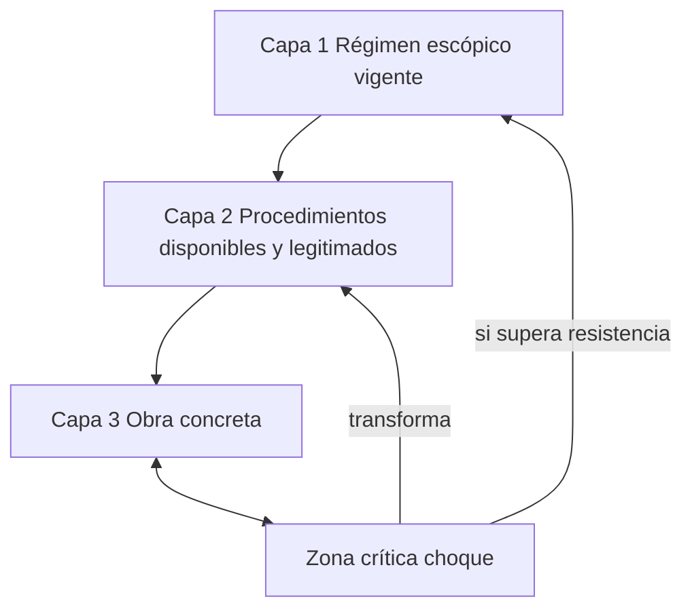

<grid drag="60 55" drop="5 10" bg="black" align="left">
# Energía II
### Clase 4
</grid>

<grid drag="-5 10" drop="5 -10" bg="black">
![[cym-header]]
</grid>

<grid drag="25 55" drop="-5 10" bg="black" align="top">
→ contextualización  
→ energía argentina 
→ régimen escópico   
→ metáfora 
</grid>

---

$$
\newcommand{\mat}{\blacksquare}
\newcommand{\obj}{\blacklozenge}
\newcommand{\agn}{\bullet}
\newcommand{\itf}{\leftrightarrow}
\newcommand{\ent}[1]{\boxed{#1}}
\newcommand{\branch}{\twoheadrightarrow}
$$
---
- Fundamentos físicos: energía como magnitud física (trabajo, calor, potencia, conservación, transformaciones).
- Historia de las fuentes energéticas: del músculo humano y animal a la biomasa, carbón, petróleo, gas, nuclear y renovables.
- Energía y geopolítica: guerras del petróleo, crisis energéticas, rutas de abastecimiento, imperialismo de recursos.
- Economía política de la energía: matrices energéticas, subsidios, dependencia tecnológica, soberanía energética.
- Energía y sociedad: cómo el acceso (o su ausencia) modela comunidades, ciudades y relaciones de poder.
- Atucha 1 y 2: funcionamiento técnico (reactor PHWR, uranio natural, agua pesada), historia del proyecto, implicancias económicas, debates ambientales y políticos.
- Arte y energía: de la noción de energía vital y creativa a la energía material para producir, distribuir y experimentar obras.
---

## ciclo de combustible nuclear CCN

- Uranio: extracción, tratamiento y conversión.
- Enriqucimiento.
- Fabricación del combustible 
- Generación de electricidad. 
- Reelaboración y reciclado de plutonio y uranión.
- Evacuación definitiva.

---

## exploración 

- reconocimiento de grandes extensiones geológicas para el estudio de la favorabilidad uranífera, hasta los cateos, manifestaciones de descubrimientos y estudios de cuantificación de reservas en los yacimientos.

---
## minería

Sierra Pintada

120 a 240 tU/año 

---

## fabricación / purificación / conversión a UO2

conversión de los concentrados de uranio que se extraen de la mina, comúnmente llamados “yellow cake”, en dióxido de uranio grado nuclear. Este proceso de conversión y purificación, en Argentina se realiza en el Complejo Fabril Córdoba (CFC)

---

## enriquecimiento 

- procesos de concentración de un isótopo de interés. 
- isótopos dos átomos del mismo elemento que tienen diferente número de neutrones. Su comportamiento químico es prácticamente igual, pero a nivel físico-atómico presentan comportamientos diferentes. 
- Por ejemplo, el U-235 fisiona con neutrones de baja energía (los llamados térmicos) mientras que para que el U-238 se necesitan neutrones de alta energía. 
- Es mucho más sencillo trabajar con neutrones térmicos (que se consiguen moderando la reacción nuclear con agua), que con neutrones rápidos lo cual crea la necesidad de separar los isótopos del uranio.

---

---

### Diferencias entre los isótopos
- U-235: tiene 92 protones y 143 neutrones. Es fisionable con neutrones térmicos, lo que lo hace útil para reactores convencionales y armas nucleares.
- U-238: tiene 92 protones y 146 neutrones. No fisiona con neutrones térmicos, aunque puede absorber un neutrón y transformarse en Pu-239, que sí es fisionable.
- Químicamente son indistinguibles (reaccionan igual en compuestos químicos), pero físicamente difieren en masa, lo que permite métodos de separación.

---

# Del yellowcake al enriquecimiento

---

### Yellowcake
- Polvo amarillo de óxido de uranio (U₃O₈).
- Se convierte químicamente en hexafluoruro de uranio (UF₆), un gas manejable para los siguientes procesos.
---
### Principio de enriquecimiento
- El objetivo es aumentar la proporción de U-235 del ~0.7% natural a valores útiles (3–5% para reactores de energía; >90% para uso militar).
- Como los isótopos tienen diferencia mínima de masa (~1%), no se pueden separar por química, sino por procesos físicos.
---

### Métodos principales
- Centrifugación de gas: el UF₆ gaseoso gira a gran velocidad; los isótopos más pesados (U-238) se concentran en la periferia, los más ligeros (U-235) en el centro.
- Difusión gaseosa (histórica): el gas pasa por membranas porosas; las moléculas con U-235 se difunden un poco más rápido que las de U-238.
---

### Próximo paso del ciclo
- El uranio enriquecido (en forma de UF₆) se convierte nuevamente en polvo de óxido de uranio enriquecido (UO₂), que luego se sinteriza en pastillas cerámicas.
- Estas pastillas se colocan en tubos metálicos para formar los elementos combustibles de un reactor nuclear.

---

[[EI enriquecimiento ]]

### paradigma operativo 

El enriquecimiento es un operador de **separación isotópica** que actúa sobre un material químicamente homogéneo ($\mat_p$), distinguiendo entre núcleos físicamente diferentes ($U$-235 y $U$-238). La materia inicial es el yellowcake ($\mat_p \subset \obj_i$), transformado en gas ($UF_6$) para habilitar procesos centrífugos. El operador busca aumentar la proporción de $\obj_s$ (átomo fisionable, U-235), desplazando $\obj_h$ (átomo fértil, U-238). El resultado es un material funcional para combustibles nucleares ($\obj_i \mapsto$ pastilla de $UO_2$).

---

 
## $\mat_p \rightarrow UF_6 \rightsquigarrow (\obj_s \cup \obj_h)$

  
### $[(\obj_s \cap \mat_p) \rightsquigarrow \obj_i] \cup [(\obj_h \cap \mat_p) \mapsto \ent{residuo}] \rightarrow \obj_i(UO_2)$

- $\mat_p$: material físico (yellowcake, $U_3O_8$).  
- $UF_6$: hexafluoruro de uranio (fase gaseosa).  
- $\obj_s$: objeto sintético fisionable (U-235).  
- $\obj_h$: hiperobjeto fértil (U-238).  
- $\obj_i$: objeto instrumental (píldora de $UO_2$ para reactor).  
- $\ent{residuo}$: uranio empobrecido (alto en U-238).  
- $\rightsquigarrow$: traducción entre dominios (concentración física de isótopos).  
- $\mapsto$: devenir funcional, transformación hacia otro uso (combustible o residuo).  
- $\cup$, $\cap$: unión y cruce de poblaciones isotópicas.

---
1.	¿Podría pensarse el enriquecimiento como una metáfora física de la “selección” cultural, donde mínimas diferencias de masa/valor generan sistemas completamente distintos?
2.	¿Qué paralelismos existen entre la separación isotópica y la composición musical por filtrado espectral (Grisey, Murail)?
3.	¿No será que la obsesión tecnológica por el enriquecimiento refleja una incapacidad de trabajar con los “neutrones rápidos”, es decir, con lo que excede el control moderado?

---

CNEA 1950 
- Ubica al pais como *early comer* 
- El tema nuclear debe ser agenda pública: capital, construcción (10-15 años), control radiológico.
- 1950-1958 Reactor de investigación RA-1.
- 1958-1966 Reactor RA-3
- Creación de SATI(Servicio de Asistencia Tecnológica a la Industria) → trabajadores especializados.
- 1964-1974 Planeamiento y construcción de Atucha I (1974)
- 1984 Hito de enriqucimiento de urano (Planta Pilcaniyeu)

---

---

---

- 1974 Inicio de obra Central Nuclear Embalse
- 1983 Interconexión con el sistema eléctrico nacional 5.5 MWh / año
- 1997 creación de NA-SA (Ley 24.804)

---

## Atucha II, 1979
- como un plan sectorial integral no solo generador de electricidad.
- Lograr la autonomía completa de todas las etapas del ciclo de combustible nuclear.

<ref>
Rodríguez, M. (2021). Estado, industria y desarrollo: Atucha II y la senda del Programa Nuclear Argentino (1979-2014). Prohistoria Ediciones.
</ref>

<ref> 
AGAGAGAG, M. (2021). Estado, industria y desarrollo: 
Atucha II y la senda del Programa Nuclear Argentino (1979-2014). Prohistoria Ediciones.
</ref>

---

- Licitada a Siemens Kraftwerk Union (KWU)
	- transferencia de KH a ENACE (Empresa Nuclear Argentina de Centrales Eléctricas)
	- 1980 comienzo de obra, 1994 paralización 2006 inauguración
	- 2014 Primera criticidad  (reacción nuclear en cadena, se sostiene a lo largo del tiempo)

---
- Dimensión emotiva, 34 años de obra:

 >[! quote] De Cicco 2015
“Atucha II es la tenacidad de aquellos que supieron cuidar la central en  los años de desánimo, la capacidad y el compromiso de las personas  que tuvieron el honor de ejecutar y supervisar el proyecto, fundamentalmente la energía de todos los que creyeron en este sueño y contribuyeron con su valioso aporte desde los distintos sectores que confroman  nuestra querida empresa.” (en De Dicco, 2015: 4)

---

###  mirada crítica
 - Greenpeace : "es un proyecto equivocado, de alto riesgo, caro, tecnológicamente obsoleto, un pesado legado de la dictadura militar. Querer reflotar este proyecto a raíz de la crisis energética es un error, hay modos mucho más eficaces de encarar la crisis y de invertir el dinero  del estado.”
 - Los verdes : "puede ser considerada la  central que más ha tardado en construirse y la más cara del mundo en relación con  el costo que implicará cada kilovatio instalado."
	- Supresión del contexto social económico político que moldea la dinámica institucional. 

---

## actores

combustibles nucleares (Conuar), conversión de dióxido de Uranio (Dioxitek), agua pesada (PIAP, ENSI), aleación de zircaloy (FAE), medicina nuclear (FCDN FUESMEN INTECNUS), propulsión (INVAP)

---

### Modelos combinatorios de estadio+ciencia+industria:

- Triángulo de Sábato (Sábato y Botana, 1975)
- Triángulos de Hierro (Balogh, 1991)
- Triple Hélice (Etzkowitz  & Leydesdorff, 2000)

---

### Definición
El modelo de la **Triple Hélice** describe la interacción dinámica y recursiva entre **Universidad, Industria y Gobierno** como motores de innovación en la sociedad del conocimiento.

---

### Principios
- La innovación surge de la **intersección** de los tres subsistemas.  
- Cada hélice puede asumir roles de las otras (hibridación).  
- Se privilegia la **retroalimentación continua** y no linealidad en los procesos.  

---

→ Universidad: conocimiento, investigación  
→ Industria: aplicación, mercado  
→ Gobierno: regulación, políticas públicas

---

### Aportes teóricos
- **Etzkowitz (2000)**: la universidad se convierte en “emprendedora” y participa en el desarrollo económico.  
- **Leydesdorff (2000)**: sistemas de innovación se analizan con teoría de la comunicación y redes.  
- Triple Hélice como un **marco evolutivo** frente a modelos lineales de I+D.

---

---

### Críticas y extensiones
- **Cuádruple Hélice**: agrega sociedad civil/medios.  
- **Quíntuple Hélice**: incluye sostenibilidad y medio ambiente.  
- Riesgo de **mercantilización del conocimiento** y debilitamiento de la autonomía académica.

---

### Conexión con prácticas musicales
Al igual que en innovación tecnológica, la música contemporánea funciona en triple hélice:  
- **Universidad** (investigación y teoría).  
- **Industria cultural** (producción, difusión).  
- **Estado** (financiamiento, políticas culturales).  
Las intersecciones producen escenas híbridas y nuevos instrumentos de legitimación.

---

# régimen escópico

---

1.	Define qué se puede ver (lo permitido o lo prohibido de mostrar).
2.	Define cómo se debe ver (perspectivas, puntos de vista, jerarquías de observación).
3.	Define quién tiene derecho a mirar y quién es objeto de la mirada.

---

- Narradores que observan desde un punto de vista privilegiado o limitado.
- Escenas que describen con precisión visual, reproduciendo cánones pictóricos o fotográficos de su época.
- Estructuras de poder inscritas en la mirada (colonial, patriarcal, de vigilancia, erótica).
- El rol de tecnologías ópticas (cámara oscura, fotografía, cine, dispositivos digitales) como modelos de narración.

---

## narrativa

---

### Régimen escópico realista decimonónico
- Características: visión omnisciente, descripción detallada siguiendo modelos pictóricos y científicos de la época.
- Ejemplo: Balzac en La Comédie humaine organiza la mirada como si fuese un catálogo social, con precisión topográfica y fisiognómica.

---
### Régimen escópico colonial
- Características: mirada del viajero/explorador europeo sobre lo exótico, con asimetría de poder.
- Ejemplo: Joseph Conrad en **Heart of Darkness**, donde el paisaje africano es filtrado por la óptica del narrador europeo.

---

## Régimen escópico cinematográfico
- Características: encuadres, cortes y zoom narrativo inspirados en el cine.
- Ejemplo: Manuel Puig en Boquitas pintadas, alternando perspectivas como montaje de planos.

---
### Régimen escópico bucólico-clásico

- Características: la naturaleza como cuadro idílico, mirada estática y ordenada.
- Ejemplo: Garcilaso de la Vega describe paisajes siguiendo la perspectiva renacentista.
---

### Régimen escópico modernista

- Características: mirada ornamental y sensorial, como si el poema fuera un vitral o un decorado.
- Ejemplo: Rubén Darío en Azul…, con escenas visuales saturadas de color y detalle decorativo.
---

### Régimen escópico fragmentario-vanguardista

- Características: ruptura de la perspectiva unificada, imágenes yuxtapuestas como collage.

---

# régimen o procedimiento ?

---

Un **procedimiento** es una herramienta o secuencia de operaciones que el creador aplica conscientemente sobre el material.

 Un **régimen escópico** es un marco de visibilidad que preexiste o condiciona tanto al creador como al espectador, y que define qué es posible ver, cómo verlo y desde dónde verlo, incluso antes de que haya un procedimiento artístico.

---

## Diferencia estructural

### Procedimiento
- *Naturaleza*: técnica o estrategia operativa.
- *Agencia*: viene desde el creador (compositor, escritor, pintor, cineasta).
- *Escala*: micro a meso (afecta al desarrollo interno de la obra).
- *Temporalidad*: se define durante la creación.
- *Ejemplo*: polifonía imitativa, montaje paralelo, stream of consciousness, variación serial, uso de leitmotivs.

---

### Régimen escópico
- *Naturaleza*: marco histórico-cultural de la mirada.
- *Agencia*: no la determina el artista, sino un entramado de convenciones sociales, tecnológicas y políticas. El artista puede operar dentro o contra él.
- *Escala*: macro (afecta la producción, la circulación y la recepción).
- *Temporalidad*: preexiste a la obra y puede persistir más allá de ella.
- *Ejemplo*: perspectiva renacentista (como forma de ver y representar), mirada colonial, óptica de la vigilancia, visualidad digital interactiva.

---

### Relación entre 

- Un procedimiento se ejecuta dentro de un régimen escópico.
- Un régimen escópico condiciona qué procedimientos son viables o legibles en un contexto dado.
- El creador puede intentar subvertir un régimen escópico modificando o inventando procedimientos, pero el marco de visibilidad sigue siendo el terreno donde ocurre la subversión.

---

### Caso comparativo

- Régimen escópico: perspectiva central renacentista 
	- impone un centro fijo y jerarquía de elementos visuales.
- Procedimiento narrativo: 
	- en el Quattrocento, un escritor podría usar descripciones lineales desde un punto fijo, siguiendo esa lógica visual. 
	- Si quisiera romperla, podría alternar puntos de vista múltiples, pero aun así dialoga con el régimen dominante.

---

### 1. Régimen escópico como infraestructura cultural
- Define el horizonte de lo que se puede percibir, legitimar y compartir colectivamente como “forma válida” de ver o representar.
- No se modifica por decisión individual inmediata: está sostenido por instituciones, medios técnicos, economía simbólica y material.

---

### 2. Procedimiento como elección táctica
- Puede alinearse con el régimen (reforzándolo) o buscar su fricción (cuestionándolo).
- Puede ser importado, adaptado, apropiado o parodiado.

---

### 3. Fricción productiva o bloqueo
- Cuando el procedimiento importado no tiene soporte cultural-material en el régimen escópico local, se produce disonancia estructural.
- Esta disonancia puede ser creativa (hibridación, resignificación) o puede anular el procedimiento (se percibe como impostado, irrelevante o incomprensible).

---

# ejemplos

---

### Vanguardias importadas en países periféricos

- Régimen escópico local: atravesado por urgencias políticas, desigualdad, violencia, narrativas de supervivencia.
- Procedimiento importado: abstracción absoluta, desligada de todo referente sociohistórico (como en cierto modernismo europeo de posguerra).

---

- Fricción: la abstracción pura se percibe como evasión o elitismo; carece de la resonancia que tendría en un contexto donde el “vacío” y la “desmaterialización” tienen sentido histórico propio.
- Resultado: en muchos casos, adopción superficial de formas sin posibilidad de sostener su “razón de ser” en el régimen local, o mutación hacia un híbrido (por ejemplo, abstracción que retiene huellas narrativas o simbólicas).

---

### El “trash” en Berlín vs. “trash” estructural en el sur global

- Berlín, fines del siglo XX:
- Régimen escópico local: sociedad con alta infraestructura, seguridad social, excedente cultural.
- Procedimiento: estetización del deterioro, apropiación de la ruina, ironía frente a lo pulcro institucional.
- País periférico:
- Régimen escópico local: deterioro, ruina y precariedad como condición real de vida, no como elección estética.
- Procedimiento “trash” importado: puede carecer de distancia irónica; se confunde con lo real y pierde capacidad crítica.

---

### modelos

---

1.	Mapear el estado previo del régimen escópico (infraestructura, normatividad, horizonte).
2.	Medir el grado de desviación del procedimiento respecto a ese régimen.
3.	Evaluar la absorción o rechazo posterior.

---

### axioma de objeto cultural 

Representamos un objeto cultural como una tupla:

$O = \langle C, P, R \rangle$
- $C$ = contexto (tipo de obra: orquesta + ballet, año, entorno cultural)
- $P$ = conjunto de propiedades (atributos técnicos, formales, materiales)
- $R$ = régimen escópico vigente (macro-condiciones habilitantes/restrictivas)

Ejemplo:

$O_{\text{Sacre}} = \langle \text{orquesta+ballet, 1913, París}, {\text{ritmo}, \text{orquestación}, \text{audiencia}, \text{auditorio}, \text{partitura}}, R_{\text{1913, París}}\rangle$

---

## transgresión como axioma

Sea $T(P_i, R)$ la función que mide si una propiedad $P_i$ transgrede el régimen $R$.
- $T(P_i, R) = 1$ → transgresión fuerte (inaceptable en el régimen vigente)
- $T(P_i, R) = 0.5$ → desviación moderada (incomoda, pero tolerable)
- $T(P_i, R) = 0$ → alineada con el régimen (ninguna fricción)

Ejemplo simplificado para Sacre:
- Ritmo: $T = 1$
- Orquestación: $T = 1$
- Audiencia: $T = 0$
- Auditorio a la italiana: $T = 0$
- Partitura escrita: $T = 0$

---

- ● = alineado con el régimen
- ◑ = desviación moderada
- ◎ = transgresión fuerte

Entonces:

Sacre = { Ritmo◎ , Orquestación◎ , Audiencia● , Auditorio● , Partitura● }

---

### 4. Regla general (axioma)

Axioma de fricción significativa:
Una obra $O$ alcanza estatus de “transformadora” si
$$
\sum_{i=1}^{n} T(P_i, R) \geq \tau
$$
donde $\tau$ es un umbral mínimo de transgresión acumulada.

Para Sacre, si ponemos $\tau = 2$, tenemos:
$T_{total} = 1 + 1 + 0 + 0 + 0 = 2$ → cumple el axioma.

---

### 5. Potencial gráfico

Esto se puede llevar a un diagrama icónico tipo Peirce:
- Eje X: propiedades del objeto (P)
- Eje Y: grado de transgresión T(P, R)
- Símbolos ●, ◑, ◎ distribuidos sobre una línea que representa la “superficie operativa” del objeto.

---

Sea
$O_{\text{Sacre}} = \langle C, P, R \rangle$
- $C$ = contexto: París, 1913, Théâtre des Champs-Élysées, estreno de ballet-orquesta.
- $P$ = { Ritmo, Orquestación, Audiencia, Auditorio, Partitura }
- $R$ = régimen escópico-musical occidental académico post-romántico y simbolista.

---

## Evaluación de transgresión

Función:
$$
T(P_i, R) =
\begin{cases}
1 & \text{transgresión fuerte} \
0.5 & \text{desviación moderada} \
0 & \text{alineado}
\end{cases}
$$

---

### Evaluación para Sacre

- Ritmo: $T = 1$
- Orquestación: $T = 1$
- Audiencia: $T = 0$
- Auditorio: $T = 0$
- Partitura: $T = 0$

Suma:
$$
T_{total} = 1 + 1 + 0 + 0 + 0 = 2
$$

--- 

Si $\tau = 2$, cumple condición de fricción significativa.

---

### 1. Variables y constantes del sistema

Sea:
- $P_i$: propiedad del objeto cultural (p.ej., Ritmo, Orquestación, etc.).
- $R_j$: atributo del régimen escópico vigente que corresponde a $P_i$.
- $T(P_i, R_j)$: intensidad de fricción (0, 0.5, 1).
- $n$: número total de propiedades.
- $\tau$: umbral de fricción significativa (constante).

---

Agregamos nuevas variables para especulación:
- $\alpha$: peso de centralidad del atributo en el régimen (importancia estructural, 0–1).
- $\beta$: elasticidad cultural (qué tan rápido el régimen puede adaptarse, 0–1).
- $\gamma$: realimentación histórica (efecto acumulativo de una transgresión previa sobre la siguiente).
- $\delta$: coeficiente de transgresión de segundo orden (transgresión de la transgresión).

---

### 2. Fórmula básica extendida

El impacto cultural de una obra se puede modelar como:

$$
I(O, R) = \sum_{i=1}^{n} \left[ T(P_i, R_j) \cdot \alpha_j \cdot (1 - \beta_j) \right] \cdot (1 + \gamma + \delta)
$$

--- 

Donde:
- Si $\beta_j$ es alto, el régimen es flexible y la transgresión tiene menor impacto.
- Si $\alpha_j$ es alto, transgredir ese atributo pesa más.
- $\gamma$ aumenta el impacto si hubo transgresiones anteriores que abrieron la brecha.
- $\delta$ modela el caso donde la obra no solo transgrede el régimen, sino que transgrede una transgresión anterior (efecto de ruptura meta-estética).

--- 

---

<iframe src="https://cym.musiki.org.ar/energia.html" allow="fullscreen" allowfullscreen="" style="height:100%;width:100%; aspect-ratio: 16 / 9; "></iframe>

---

