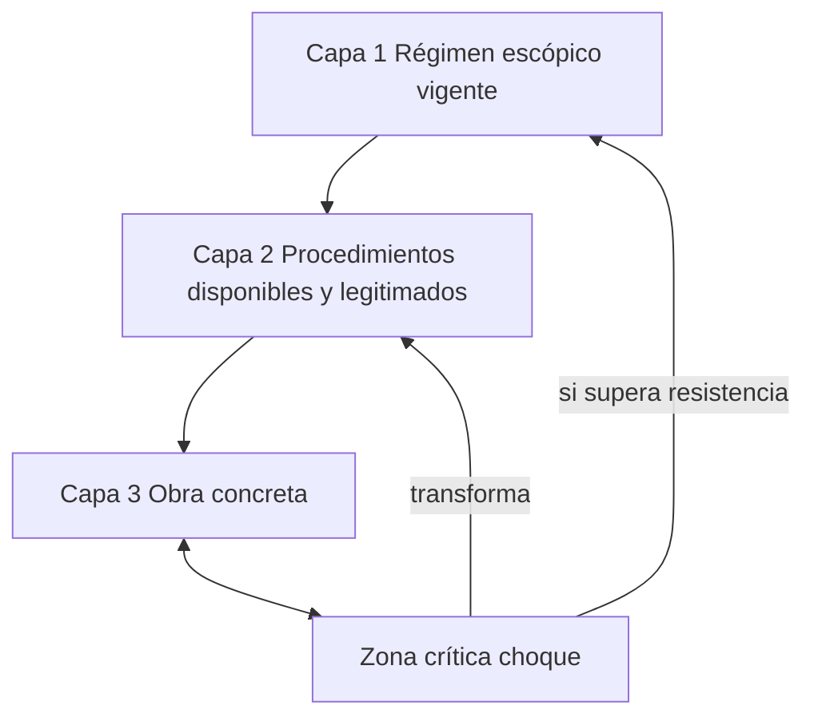
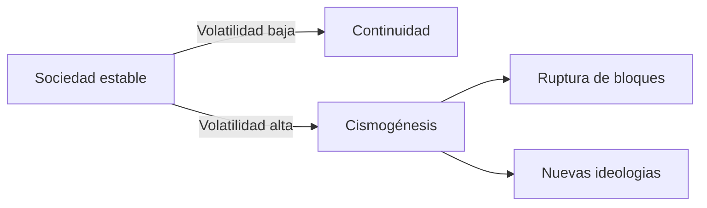

<grid drag="60 55" drop="5 10" bg="transparent" align="left">
# metáfora y re
## Clase 5
</grid>

<grid drag="-5 10" drop="5 -10" bg="black">
![[cym-header]]
</grid>

<grid drag="25 55" drop="-5 10" bg="black" align="top">
→ RE repaso  
→ metáfora
→ un ejemplo de REyM 
→ blogs 
→ obras 
</grid>

$$
\newcommand{\mat}{\blacksquare}
\newcommand{\obj}{\blacklozenge}
\newcommand{\agn}{\bullet}
\newcommand{\itf}{\leftrightarrow}
\newcommand{\ent}[1]{\boxed{#1}}
\newcommand{\branch}{\twoheadrightarrow}
$$
---

### fórmula general de RE

## $I(O, R) = \sum_{i=1}^{n} \left[ T(P_i, R_j) \cdot \alpha_j \cdot (1 - \beta_j) \right] \cdot (1 + \gamma + \delta)$

Sea:
- $P_i$: propiedad del objeto cultural (p.ej., Ritmo, Orquestación, etc.).
- $R_j$: atributo del régimen escópico vigente que corresponde a $P_i$.
- $T(P_i, R_j)$: intensidad de **fricción** (0, 0.5, 1).
- $n$: número total de propiedades.

- $\beta_j$ **elasticidad** cultural (qué tan rápido el régimen puede adaptarse, 0–1).
 si es alto, el régimen es flexible y la transgresión tiene menor impacto. 
- $\alpha_j$ peso de **centralidad** del atributo en el régimen (importancia estructural, 0–1). si es alto, transgredir ese atributo pesa más.
- $\gamma$   **realimentación histórica** (efecto acumulativo de una transgresión previa sobre la siguiente).aumenta el impacto si hubo transgresiones anteriores que abrieron la brecha.
- $\delta$ coeficiente de **transgresión de segundo orden** (transgresión de la transgresión). modela el caso donde la obra no solo transgrede el régimen, sino que transgrede una transgresión anterior (efecto de ruptura meta-estética).

---
### modelo escópico

---

## transgresión como medida

Sea $T(P_i, R)$ la función que mide si una propiedad $P_i$ transgrede el régimen $R$.
- $T(P_i, R) = 1$ → transgresión fuerte (inaceptable en el régimen vigente)
- $T(P_i, R) = 0.5$ → desviación moderada (incomoda, pero tolerable)
- $T(P_i, R) = 0$ → alineada con el régimen (ninguna fricción)

---

## Volatilidad de Pedersen y Régimen Escópico

---

La **volatilidad de Pedersen** mide el grado de reacomodo de la opinión pública entre dos momentos de decisión, como ser elecciones o plebiscitos.  
Se interpreta como un índice de la **energía social de cambio**, comparable entre países y períodos.

<ref>Pedersen, Mogens N. (1979). The Dynamics of European Party Systems: Changing Patterns of Electoral Volatility. European Journal of Political Research.</ref>

---

## Fórmula de Pedersen

$$
V_t = \frac{1}{2} \sum_i | p_{i,t+1} - p_{i,t} |
$$

Donde:
- $p_{i,t}$ = porcentaje de votos del partido $i$ en la elección $t$  
- $V_t$ = índice de volatilidad entre dos elecciones consecutivas

---

## Tabla comparativa de Pedersen

| País          | Período (2005–2025) | Promedio Pedersen | Picos relevantes | Notas |
|---------------|---------------------|------------------|------------------|-------|
| Argentina     | 2005–2023           | 22–25            | >30 (2013, 2021) | Alta volatilidad, alianzas nuevas y colapsos de coaliciones |
| Brasil        | 2006–2022           | 18–22            | >25 (2018)       | Fragmentación, entrada de Bolsonaro y PSL en 2018 |
| Chile         | 2005–2021           | 15–20            | >25 (2017, 2021) | Quiebre del sistema binominal y auge de independientes |
| Reino Unido   | 2005–2024           | 12–16            | 23.5 (2019–24)   | Brexit y Reform generaron reconfiguración abrupta |
| Alemania      | 2005–2021           | 10–15            | 15.6 (2017–21)   | Estabilidad relativa, pero AfD y Verdes mueven el tablero |
| Francia       | 2007–2022           | 12–18            | >20 (2017)       | Colapso PS y ascenso Macron/En Marche |
| Suiza         | 2007–2023           | 8–12             | ~15 (2019)       | Sistema multipartidario pero con volatilidad moderada |
| Estados Unidos| 2006–2022           | 5–8              | ~10 (midterms)   | Bipartidismo reduce la volatilidad nacional agregada |
| Canadá        | 2006–2021           | 10–15            | ~18 (2011, 2019) | Alternancia entre liberales y conservadores con NDP emergente |
| Australia     | 2007–2022           | 8–12             | ~15 (2010, 2019) | Estabilidad de bloques, pero variaciones en voto secundario |

<ref>Pedersen (1979), ParlGov (2009–2023), LAPALE (2005–2025), IFES ElectionGuide, Bundeswahlleiter (Alemania 2017–21), House of Commons Library (UK 2015–24), Ministère de l’Intérieur (Francia 2017–22), Swiss FSO (2015–23), Elections Canada (2015–21), AEC Australia (2016–22), MIT Election Data Lab (EEUU 2006–22), Jones (2021), Power (2019), Luna & Altman (2011).</ref>
---

---

Volatiblidad de participación de mujeres en los parlamentos africanos

---

## Cismogénesis (Bateson)

Gregory Bateson definió la **cismogénesis** como el proceso de intensificación de diferencias en interacciones sociales.  
La volatilidad de Pedersen puede leerse como una forma cuantitativa de cismogénesis: cada cambio social refuerza diferencias, generando una dinámica de ruptura o complementariedad.

<ref>Bateson, Gregory (1936). Naven: A Survey of the Problems Suggested by a Composite Picture of the Culture of a New Guinea Tribe.</ref>

---

## Visualización de dinámicas

---

Aplicación a una obra cym 
- Propiedades ($P_i$): Ritmo, orquestación algorítmica, interfaz, interacción ,uso de feedback.
- Régimen escópico ($R_j$): Normas de percepción y expectativas de performance.
- Medida: Se cuantifica la fricción de cada propiedad respecto al régimen.
- Analogía con Pedersen: Así como la sociedad muestra volatilidad en decisiones, la obra muestra volatilidad perceptiva en su interacción con los regímenes escópicos.

---

### se puede medir nuestro *régimen escópico*?

---

# metáfora 
(μεταφορά, traslado, desplazamiento, transportar)

---

-  figura retórica que afirma directamente que una cosa es otra, creando una comparación para resaltar similitudes y añadir significado.

---

<iframe src="https://es.wikipedia.org/wiki/Met%C3%A1fora" allow="fullscreen" allowfullscreen="" style="height:100%;width:100%; aspect-ratio: 16 / 9; "></iframe>

---

### Borges

- Lugones: Lunario Sentimental,  el idioma es un conjunto de metáforas. 
- El ultraismo ya es formulado por Lugones
- La metafora como convenio colectivo 
	- Los 10.000 seres como metáfora del Universo (China), los 10.000 arquetipos =  10.000! (10mil factorial)
- Apariencia de la metáfora: 
	- Su tumba son de Flandres las campañas y su epitafio la sangrienta luna. (Quevedo)
	- Eclipsar la tracia Luna (Quevedo, como la bandera de los turcos eclipsada por el títere Osuna)
---

gaviota del odio, halcón de la sangre, cisne sangriento o cisne rojo, significan el cuervo  (Snorri Sturluson).

note:
- Snorri Sturluson sXIII glosario de las figuras tradicionales de la poesía de Islandia en el que se lee, por ejemplo, que gaviota del odio, halcón de la sangre, cisne sangriento o cisne rojo, significan el cuervo; y techo de la ballena o cadena de las islas, el mar; y casa de los dientes, la boca. Entretejidas en el verso y llevadas por él, estas metáforas deparan (o depararon) un asombro agradable; luego sentimos que no hay una emoción que las justifique y las juzgamos laboriosas e inútiles. He comprobado que igual cosa ocurre con las figuras del simbolismo y del marinismo.

---

la intuición de una **analogía** entre cosas disímiles (Aristóteles, Retórica, Libro III)

---
- funda la metáfora sobre las cosas y no sobre el lenguaje.
- exige que la analogía debe ser real y que hasta entonces no haya sido notada (Middleton Murry, Countries of the Mind, II, 4). 

- los tropos conservados por Snorri son (o parecen) resultados de un proceso mental, que no percibe analogías sino que combina palabras; 

- alguno puede impresionar (cisne rojo, halcón de la sangre), pero nada revelan o comunican. Son, para de alguna manera decirlo, objetos verbales, puros e independientes como un cristal o como un anillo de plata. 

---

- Parejamente, el gramático Licofronte llamó león de la triple noche al dios Hércules porque la noche en que fue engendrado por Zeus duró como tres; la frase es memorable, allende la interpretación de los glosadores, pero no ejerce la función que prescribe Aristóteles.

---

### filosofía

- Aristóteles (*Poética*): 
      - la metáfora se define como "traslado de un nombre de un objeto a otro" por semejanza o proporción, cuyo principio es la **analogía**.
   - Kant:
      - forma de acceso indirecto a lo inteligible. 
   - Paul Ricoeur, *La métaphore vive*
      -  creación semántica que **reestructura** el campo de referencia. 
      - Acto de **redescripción**.
   - Jacques Derrida la analiza como **diseminación infinita de sentido.** 

---

### ciencias cognitivas
(Lakoff - Johnson)

La metáfora organiza dominios abstractos (tiempo, moralidad) a partir de dominios concretos (espacio, movimiento). 

### proyecciones de un 
**dominio fuente (source domain)** a un **dominio objetivo (target domain)**.

activan redes neuronales superpuestas (e.g., estudios fMRI muestran activación compartida en áreas sensoriales). En computación, se modelan como transformaciones en grafos de conocimiento (e.g., en ontologías semánticas).

<ref>  George Lakoff y Mark Johnson, 1984, *Metaphors We Live By*  </ref>

--

### geometría

- morfismo parcial entre espacios de propiedades.
	- **morfismo** implica un mapeo que preserva ciertas estructuras (como relaciones o propiedades).
	- **parcial** indica que no todas las propiedades se transfieren, evitando isomorfismos totales que harían los dominios idénticos.

---

"La metáfora es un *morfismo parcial* y estructurado entre *espacios* de *propiedades* multidimensionales, donde el *mapeo* selecciona y proyecta *subconjuntos* de *atributos* para generar insights novedosos, preservando invariantes relacionales mientras permite *emergencias* semánticas."

---

### tesaurio

 "**morfismo**" implica un mapeo que preserva ciertas estructuras (como relaciones o propiedades),

---

**parcial** indica que no todas las propiedades se transfieren, evitando isomorfismos totales que harían los dominios idénticos. 
 Un mapeo $ f: S_{fuente} \to S_{objetivo}$ que es inyectivo o suryectivo solo en un subconjunto. Formalmente, es una función parcial $ f \subseteq S_{fuente} \times S_{objetivo}$que preserva relaciones seleccionadas (e.g., si "calor" en fuente mapea a "intensidad" en objetivo, pero no "luz"). Esto evita transferencias incongruentes, como en la metáfora "el amor es fuego", donde se mapea "calidez" pero no "destructividad" (a menos que sea intencional, como en metáforas poéticas oscuras).
 
---

**espacios de propiedades** pueden interpretarse como conjuntos multidimensionales de atributos (físicos, sensoriales, emocionales) en un espacio vectorial o topológico.

 Representan dominios conceptuales como espacios vectoriales en un modelo de embeddings (e.g., similar a Word2Vec o BERT en IA). Cada espacio es un conjunto $ S = \{ p_1, p_2, \dots, p_n \} $ , donde $ p_i$ son propiedades (atributos cualitativos o cuantitativos, como "calor" para fuego o "pasión" para amor). En términos topológicos, estos espacios pueden ser manifolds donde las propiedades están conectadas por similitudes métricas (e.g., distancia euclidiana o coseno).

---

### proyecciones

- **Lingüística cognitiva**: Lakoff y Johnson ven las metáforas como "mappings cross-domain" sistemáticos (e.g., ARGUMENTO ES GUERRA). Ampliación: Los espacios de propiedades son "image schemas" (esquemas imagéticos) como CONTAINER o PATH, mapeados parcialmente.

- **Matemáticas y computación**: En teoría de grafos, una metáfora es un homomorfismo parcial entre grafos dirigidos (nodos = propiedades, aristas = relaciones). En machine learning, se modela como transfer learning: entrenar en fuente y aplicar parcialmente a objetivo.

---

## dialogGPT

---

### ejemplos js

---

---

León Ferrari, La civilización occidental y cristiana (1965)

---

## Contexto RE: Argentina 1955–1965

- Alternancias forzadas, proscripciones y reacomodos rápidos del electorado
- Volatilidad de Pedersen (legislativas/panorámica histórica): alta (≈20–30)
- Parámetros de régimen escópico (para el período):
  - α≈1 (alta centralidad normativa: religión, nación, orden)
  - β≈0 (baja elasticidad cultural efectiva ante rupturas icónico-religiosas)
  - γ≈0.3 (realimentación histórica: ciclos de censura/debate intensifican fricción)
  - δ≈0 (baseline; se activa >0 cuando hay “transgresión de la transgresión” en reexhibiciones, polémicas, reapropiaciones)

---

## Obra: “La civilización occidental y cristiana” (León Ferrari, 1965)

- Materiales: madera, óleo, yeso; Cristo de santería sobre avión de guerra
- Operación: injerto icónico-religioso + artefacto tecno-militar contemporáneo (Vietnam)
- Efecto: colisión simbólica entre soteriología cristiana y violencia tecnocientífica
- Historia de recepción: censura inicial (Di Tella), controversias periódicas, expansión de sentido en reexhibiciones posteriores

---

## Metáfora mínima (operador mediador)

$$M=f(S,T,\mu)$$

- S: iconografía cristiana (crucifixión)
- T: máquina de guerra moderna (bombardero)
- μ: mapeo parcial por injerto icónico (transbasamiento S→T que produce colisión semántica)

Resultado: un signo icónico compuesto que reescribe ambos dominios (religión/tecnociencia) bajo una misma forma.

---

## Atributos para RE (régimen escópico) y pesos α

- P1 iconoclasmo religioso (α=1.0)
- P2 injerto tecno-militar contemporáneo (α=0.9)
- P3 dispositivo expositivo/performativo (suspensión, montaje, escala) (α=0.6)
- P4 indexicalidad histórico-política (Vietnam, OEA) (α=0.9)
- P5 institucionalidad/recepción (censura, prensa, iglesia) (α=0.8)

β≈0 ⇒ (1−β)=1; γ=0.3; δ=0 (línea base). Factor global=(1+γ+δ)=1.3

---

## Asignación de transgresiones T(Pi,R) en 1965

- T(P1)=1.0  (blasfemia percibida; choque con normativas icónicas)
- T(P2)=1.0  (guerra moderna como soporte del Cristo)
- T(P3)=0.7  (modo de exhibición no convencional para la iconografía)
- T(P4)=1.0  (señalamiento directo del conflicto geopolítico)
- T(P5)=1.0  (censura/controversia activan la fricción institucional)

Suma ponderada:
1.0·1.0 + 1.0·0.9 + 0.7·0.6 + 1.0·0.9 + 1.0·0.8
= 1.0 + 0.9 + 0.42 + 0.9 + 0.8
= 4.02

Índice escópico de la obra (1965):
$$I(O,R)=4.02 \times 1.3 = 5.226$$

Lectura: transgresión estructural alta en un régimen de baja elasticidad y alta centralidad normativa, amplificada por retroalimentación histórica (γ).

---

## Tabla de cálculo

| Atributo (Pi)                          | α    | T(Pi,R) | α·T | Comentario breve |
|----------------------------------------|------|---------|-----|------------------|
| P1 iconoclasmo religioso               | 1.0  | 1.0     | 1.00| Cristo+avión como colisión sacra |
| P2 injerto tecno-militar               | 0.9  | 1.0     | 0.90| máquina de guerra como cruz |
| P3 dispositivo expositivo              | 0.6  | 0.7     | 0.42| suspensión/ensamblaje perturbador |
| P4 indexicalidad histórico-política    | 0.9  | 1.0     | 0.90| Vietnam como anclaje directo |
| P5 institucionalidad/recepción         | 0.8  | 1.0     | 0.80| censura y polémicas activas |
| Suma ponderada                         |      |         |4.02|                  |
| Factor (1+γ+δ)=1.3                     |      |         |    | γ=0.3; δ=0       |
| I(O,R)                                 |      |         |5.226| alto impacto      |

---

## Tipo de metáfora y “transgresión de segundo orden”

- Tipo: metáfora disyuntiva-injerto (S⊔T con μ parcial). No busca analogía suave; fuerza colisión icónica.
- δ>0 en reexhibiciones polémicas (p.ej. 2004): la obra transgrede la transgresión previa (meta-ruptura), elevando el factor (1+γ+δ) y, por tanto, I(O,R).

---

## Diagrama (metáfora→RE)

-  Heidegger, Ladrière y Vioulac: la técnica moderna aparece como destino metafísico de Occidente. El avión simboliza ese despliegue técnico.
- condensa dos dominios semánticos opuestos (soteriología cristiana y tecnociencia bélica), generando un shock visual y conceptual.
- nace como protesta contra la guerra de Vietnam, pero su alcance crítico excede lo coyuntural: cuestiona la violencia estructural de la civilización occidental y la connivencia entre religión y poder militar.

---

## Fórmula icónica

$$
\newcommand{\mat}{\blacksquare}
\newcommand{\obj}{\blacklozenge}
\newcommand{\agn}{\bullet}
\newcommand{\itf}{\leftrightarrow}
\newcommand{\ent}[1]{\boxed{#1}}
$$

$$
(\obj_s \rightsquigarrow \obj_i) \mapsto \ent{c}
$$

Donde un objeto sintético se traduce en objeto instrumental para generar un concepto ($\ent{c}$).

1.	Sea un espacio semántico $S$ con elementos (conceptos, imágenes, sonidos).
2.	Una metáfora es una función $f: A \to B$ tal que $f$ no respeta la identidad ni la pertenencia directa, sino que proyecta propiedades estructurales de $A$ en $B$.
3.	Formalmente, si $A$ y $B$ son subconjuntos de $S$, la metáfora establece una correspondencia parcial $M \subset A \times B$ donde $(a,b) \in M$ si hay una propiedad común o resonante $P$ tal que $P(a) \approx P(b)$.
4.	Geométricamente, equivale a un puente o morfismo entre espacios vectoriales: proyecta un vector semántico de un dominio en otro dominio no isomorfo, generando un “salto de dimensión” perceptual.
5.	Esta operación puede representarse como un morphing topológico: la metáfora deforma el espacio semántico de A hasta hacerlo coincidir, parcialmente, con el de B.
6.	

