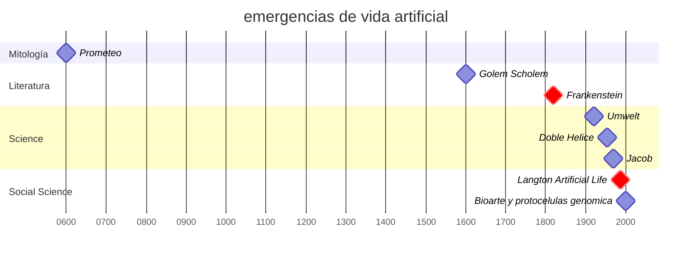
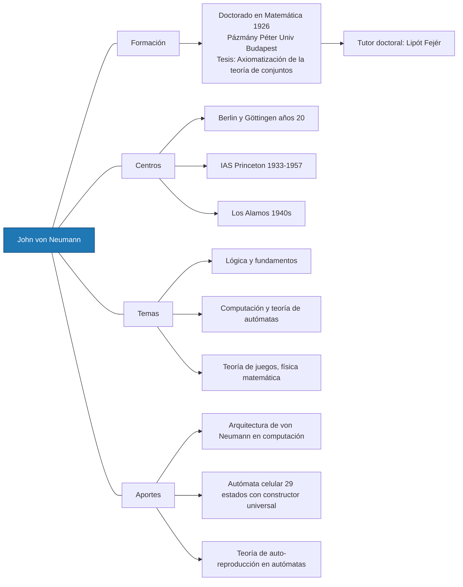

$$
\newcommand{\mat}{\blacksquare}
\newcommand{\obj}{\blacklozenge}
\newcommand{\agn}{\bullet}
\newcommand{\itf}{\leftrightarrow}
\newcommand{\ent}[1]{\boxed{#1}}
\newcommand{\branch}{\twoheadrightarrow}
$$
---


---


---


James Whale, Boris Karloff, Bernhard Kaun, 1931

---


<iframe title="Frankenstein 1931 - opening scene" src="https://www.youtube.com/embed/WJU7jd7EVdI?feature=oembed" height="113" width="200" allowfullscreen="" allow="fullscreen" style="aspect-ratio: 1.76991 / 1; width: 100%; height: 100%;"></iframe>


---




```
timeline
    -700:  Prometeo, efesto
    1600: "Golem en lectura moderna (Scholem)"
    1818: "Frankenstein (Shelley)"
    1900: "Umwelt (von Uexküll)"
    1953: "Doble hélice; hacia biología molecular"
    1970: "Jacob: programa/operón; regulación"
    1987: "Langton nombra Artificial Life"
    2000s: "Bioarte y protocélulas; genómica pública"
```


note: 
Jacob, F. programa/regulación; 
Uexküll, Umwelt; Yudell & DeSalle, genómica; 
Whitelaw, historia ALife en arte.        

- Mary Shelley instala una matriz narrativa: creación técnica de lo vivo, responsabilidad del creador, estatuto del monstruo y del testigo
- En ciencia contemporánea, esa matriz reaparece como problema de reproducción, copia/error y regulación de lo vivo, e introduce a la vez un léxico técnico y ético para experimentar con vida artificial
- En historia de la biología puede leerse como pasaje del régimen de la “generación” al de la “reproducción” y su economía de copias y variaciones, clave para pensar herencia, mutación y síntesis de vida artificial Jacob, F. The Logic of Life. Sobre el giro semántico de generación→reproducción y la emergencia del gen y la regulación.
	
---


- *Grecia*: **Prometeo** (fuego/técnica), **Hefesto** y autómatas/seres forjados, **Pigmalión** (forma animada)
- Tradiciones hebreas: el **golem** como vida técnica y obediente, comentada moderno-críticamente por Scholem
- Estas genealogías articulan tres escenas: **transferencia** de potencia, fabricación de agentes y **animación** de materia; todas reaparecen en IA/ALife como problemas de **agencia**, **regulación-control** y valor.
- del mito al **prototipo**, del relato a la infraestructura (laboratorio, taller, código), donde la estética funciona como banco de pruebas epistémico.

---

### siglo XVIII

- de generación (origen/formación) a reproducción (copias y linajes).
- preparando la **cuantificación** de herencia, **estadística** y el **gen** como *paradigma operativo*

---

-  se hacen pensables **error**, **regulación**, **mensaje** y **memoria molecular**: categorías que hoy fundan nociones de síntesis, prototipos vivos y ALife.
- Frankenstein operativiza el pasaje: *ensamblar/animar* +   “*regular*” 
- El prólogo de Cobb al volumen 2022 destaca el giro terminológico y su efecto en la historia de la herencia.  

> [!tip] de generación a reproducción
> pasaje decisivo entre la biología premoderna y la molecular.
> señala el momento en que la biología comienza a pensarse como ciencia de la *información* antes de que existiera la palabra “información”.Donde antes había un flujo vital, ahora se detecta un sistema de transmisión de caracteres, una codificación susceptible de cuantificación y análisis estadístico.

note: 
Durante siglos, la noción de generación —heredera de Aristóteles y la filosofía natural clásica— remitía al acto de producir lo nuevo, a la emergencia de una forma viva a partir de una potencia vital. “Generar” era un verbo que contenía una cierta dimensión ontológica: implicaba creación, novedad, variación, incluso contingencia. En cambio, reproducir se consolida en el siglo XVIII como una categoría de la regularidad, del modelo replicable y del circuito cerrado de la herencia.

El pasaje de generación a reproducción señala el momento en que la biología comienza a pensarse como ciencia de la información antes de que existiera la palabra “información”.
Donde antes había un flujo vital, ahora se detecta un sistema de transmisión de caracteres, una codificación susceptible de cuantificación y análisis estadístico.

Este cambio no solo reorganizó el campo de la biología; modificó el imaginario de lo vivo. El cuerpo dejó de ser un foco de fuerzas misteriosas o formativas para convertirse en un soporte de instrucciones, una máquina replicante capaz de ser analizada, reparada o copiada. En términos de historia de las ideas, la sustitución refleja el paso del pensamiento organicista (propio de la filosofía natural) a un pensamiento cibernético y molecular, que entiende la vida como un proceso de regulación, retroalimentación y control.

Cobb observa que esta sustitución terminológica tiene resonancias culturales y éticas: al hablar de reproducción en lugar de generación, la biología introduce un modelo donde la vida puede fallar, corregirse o mejorarse, y donde la variación se convierte en un problema técnico antes que en una fuente de misterio.

De allí la relevancia estética y filosófica del mito de Frankenstein, que emerge en el mismo período histórico. La criatura de Shelley encarna la paradoja del nuevo régimen semántico: un ser “generado” técnicamente, pero “reproducido” en el sentido moderno —es decir, ensamblado bajo un modelo de replicación imperfecta. Frankenstein es, en ese sentido, la primera alegoría de la biología informacional: un cuerpo como programa mal transcrito.

---
## Jakob Johann von Uexküll

# Umwelt

*el mundo circundante, perceptible en donde un organismo actúa como agente*

- von Uexküll redefine al organismo por su Umwelt: mundos-sentido específicos que recortan señales/acciones
- En clave de Frankenstein/ALife: cada criatura sitúa su mundo; el “monstruo” es desajuste de umbrales y acoples, no mero exceso de materia
- Para el arte-ciencia, Umwelt guía diseño de interfaces, sensores/actuadores y criterios de agencia no-humana Uexküll, Ideas para una concepción biológica del mundo; prólogo de Ortega y crítica al darwinismo mecanicista vulgar.  

note: 
se niega a hablar de las formas inferiores de vida. La vida es perfecta por doquier, es la misma en los círculos estrechos y en los más amplios. A tenor de su estructura, cada organismo posee anatómicamente un determinado sistema «receptor» y «efector». Ningún organismo podría sobrevivir sin la compleja cooperación de ambos sistemas, eslabones de una cadena descrita por Uexküll como «círculo funcional».​ La idea del Umwelt viene acompañada de los estudios musicales realizados por Uexküll. En ellos propone una naturaleza con estructura musical donde todas las funciones del cuerpo dependen de una armonía interna que ayuda a que se desempeñen correctamente en aras de su propósito.

---

## biosemiótica de von Uexküll


---

 

<ref> Uexküll,J.J. 1920, "Theoretische Biologie"</ref>

note: 
Diagrama de Jakob von Uexküll sobre el ciclo funcional regido por normas que crea el mundo perceptivo interno de un animal, , 117; trad. al inglés (1926), 155. 
- Esto ilustra, para Uexküll, las dos partes interdependientes de un mundo interior: **la que recibe impresiones** («mundo tal y como se percibe»/*Merkwelt*) y **la que distribuye efectos** («mundo de la acción»/*Wirkungswelt*), entre las que se encuentra el «ciclo funcional completo». El «órgano de percepción» (**Merkorgan**) y el «órgano de acción» (**Handlungsorgan**) siguen cada uno una regla: uno organiza las impresiones en el órgano de percepción, creando así indicaciones; el otro organiza los efectos producidos por el órgano de acción, creando así acciones.

La recurrente invocación de metáforas musicales no solo refleja la inclusión de modelos artísticos dentro de la teoría del Umwelt, sino que también destaca la característica del universo viviente, donde el diseñador, el actor y el observador reflexivo se integran en uno. 

---

- el concepto de Umwelt implica una **síntesis** del objeto y el observador: «postula que las leyes de las ciencias naturales no son leyes de la naturaleza, sino reglas que derivamos para nuestros propios objetivos a partir de nuestra confrontación con los fenómenos naturales» *(T. von Uexküll 1987: 151).*

---

 Uexküll establece un universo tripartito. En un diálogo con su discípulo Peeter Torop, Lotman postula que los seres humanos habitan un mundo definido por la unidad dialéctica de los modelos científicos y artísticos (Torop 2009).
 
---

# → Umwelt 
## → Semiosphere (Eco, Lotman 1990)
### → Logosphere (Bakhtin)
#### → Biosphere (Vernadsky)
##### → **Noosphere** (Vernadsky + Teilhard de Chardin)


note: 
- Umwelt: cada organismo vive en un microcosmos perceptivo propio, un mundo-sentido que delimita su modo de conocer y actuar.
- Semiosphere: el conjunto interconectado de todos los procesos de significación donde los umwelten individuales se superponen y comunican.
- Logosphere: la esfera histórica del lenguaje y del discurso donde la semiosis humana se articula y ordena simbólicamente.
- Biosphere (Vernadsky): la totalidad de la vida como fuerza geológica activa que transforma la materia terrestre.
- Noosphere (de Chardin–Vernadsky): la capa cognitiva planetaria donde la conciencia y el pensamiento colectivo se vuelven fuerza evolutiva.

---

# →noósfera 
## → noocenosis 
### → noocenología
#### → noóscoopo

<br>
<br>
<br>


note: 

1. La **noosfera** (también escrita noösfera) es un concepto filosófico desarrollado y popularizado por el biogeoquímico Vladimir Vernadsky y el filósofo y sacerdote jesuita Pierre Teilhard de Chardin. Vernadsky definió la noosfera como el **nuevo estado de la biosfera,** y la describió como la «esfera de la razón» planetaria. La noosfera representa la etapa más alta del desarrollo biosférico, la de las actividades racionales de la humanidad.

La palabra deriva del griego νόος («nous, mente, razón») y σφαῖρα («esfera»), en analogía léxica con «atmósfera» y «biosfera».El concepto no puede atribuirse a un solo autor. Los autores fundadores *Vernadsky* y *de Chardin* desarrollaron dos conceptos relacionados pero muy diferentes, el primero basado en las ciencias geológicas y el segundo en la teología. Ambas concepciones de la noosfera comparten la tesis común de que la razón humana y el pensamiento científico han creado, y seguirán creando, la siguiente capa geológica evolutiva. Esta capa geológica forma parte de la cadena evolutiva. Los autores de segunda generación, predominantemente de origen ruso, han desarrollado aún más el concepto de Vernadsky, creando los conceptos relacionados: noocenosis y noocenología.

2. **Noocenosis**: comunidad “bio–técnica” artificial, diseñada por intervención humana sobre ecosistemas degradados; deriva de biocenosis+nous. Autores: V. V. Petrashov (quien introduce el término en los 90), S. S. Shwarts (noobiogeocenosis).  
3. **Noocenología**: “ciencia” o marco de estudio para restauración de ecosistemas y creación/gestión de noocenosis; formulada por Petrashov (Introducción a la Noocenología, 1993; Principios de Noocenología, 1998).  

---

## nooscope  

(Matteo Pasquinelli, 2020)
https://kim.hfg-karlsruhe.de/nooscope.ai/


1. instrumento epistemológico
2. difracción de la razón
3. extractivismo cognitivo
4. sociedad de clasificación y predicción
5. error como forma de conocimiento. 


note: 
1. Instrumento epistemológico
La Nooscope redefine la IA como un instrumento de observación cognitiva, no como una mente autónoma: amplifica la percepción humana sobre grandes espacios de datos, del mismo modo que el telescopio amplía la visión óptica. Su objetivo es secularizar la IA, despojándola del mito de la “máquina pensante”.

2. Difracción de la razón
Pasquinelli describe la IA como una racionalidad difractada: sus algoritmos no producen conocimiento puro sino correlaciones deformadas por sesgos técnicos y sociales, reemplazando la episteme causal por una de correlación automática y estadística.
	3.	Extractivismo cognitivo
El aprendizaje automático se sostiene en la explotación global de datos y trabajo humano. La Nooscope denuncia el colonialismo epistémico de las corporaciones tecnológicas que capturan inteligencia social para convertirla en valor económico.
	4.	Sociedad de clasificación y predicción
La IA organiza la vida social mediante procesos masivos de reconocimiento y anticipación, instaurando un régimen de normalización algorítmica que sustituye las instituciones disciplinarias por un control estadístico y predictivo.

5.	Errores como forma de conocimiento
Pasquinelli propone leer los fallos, sesgos y vulnerabilidades de los modelos estadísticos como síntomas epistemológicos: la Nooscope es también un mapa de distorsiones, una crítica del ojo maquínico y sus límites para detectar lo nuevo.

---


---


---


## conceptos de vida 

- un *sistema* químico autosostenible capaz de experimentar la evolución darwiniana (Gerald Joyce)
- un *sistema* autoorganizado de no-equilibrio de tal modo que sus procesos se gobiernan simbólicamente y puede reproducirse a si mismo , e incluso re-programarse (Lee Smolin)

---

 - patrones preservados *dinámicamente*. 

---

en términos computacionales 
- modelos de sistemas de vida enfocados en comprender
- y predecir comportamientos para la regulación (metabolismo) y la reproduccieon (regeneración)


---

[[agentes cantores con ollama]]

---


---

1. Contexto cósmico
- La Tierra se forma hace 4.600 millones de años.
- Se enfría y aparece agua líquida hacia los 4.400 Ma.
- Meteoritos y cometas aportan aminoácidos y bases nitrogenadas.
- Condiciones favorables para la síntesis prebiótica.

---

2. Síntesis prebiótica
- Experimento de Miller–Urey (1953): descargas eléctricas → aminoácidos.
- Formación plausible de azúcares, lípidos y nucleótidos.
- La química se vuelve progresivamente orgánica y autoorganizada.

---

3. Autoensamblaje molecular
- Lípidos en agua → vesículas espontáneas (protocélulas).
- Se forman membranas: primera frontera entre interior y exterior.
- Surge el principio de autopoiesis: mantener una organización interna.

---

4. Hipótesis del Mundo del ARN
- El ARN cumple doble función:
- Almacén de información (como ADN).
- Catalizador (ribozimas).
- Pequeños ARN replicantes fueron los primeros agentes de herencia.


note:
El ácido ribonucleico (ARN) es una molécula biológica fundamental que actúa como intermediario crucial en la expresión de la información genética codificada en el ADN. Su estructura primaria es una cadena lineal de nucleótidos, cada uno compuesto por un azúcar ribosa, un grupo fosfato y una base nitrogenada (adenina, guanina, citosina o uracilo). Esta secuencia determina su <mark class="hltr-green">función</mark> e identidad. Estructuralmente, el ARN a menudo se pliega en formas tridimensionales complejas mediante apareamientos de bases intramoleculares, formando hélices y bucles que son esenciales para su actividad. Sus funciones son diversas: el ARN mensajero (ARNm) transporta las instrucciones genéticas para la síntesis de proteínas; el ARN de transferencia (ARNt) entrega los aminoácidos específicos al ribosoma durante la traducción; y el ARN ribosomal (ARNr) forma el andamiaje estructural y catalítico del propio ribosoma. Otras formas, como los ARN pequeños de interferencia (siRNA) y microARN (miRNA), están implicadas en la regulación de la expresión génica.

El ADN es un biopolímero que codifica la información genética para el desarrollo, funcionamiento, crecimiento y reproducción de todos los organismos conocidos y muchos virus. Su estructura primaria es una secuencia de nucleótidos—adenina (A), timina (T), citosina (C) y guanina (G)—unidos por un esqueleto de azúcares desoxirribosa y grupos fosfato. Su estructura secundaria es la doble hélice, estabilizada por puentes de hidrógeno entre pares de bases complementarios (A-T y C-G). Esta disposición permite los mecanismos de replicación semiconservativa y transcripción, fundamentales para la herencia biológica. Más allá de su función biológica primordial, el ADN se conceptualiza como un sistema de almacenamiento de información digital-analógico, un <mark class='hltr-blue'>código</mark> natural con una sintaxis y semántica propias que opera a través de procesos bioquímicos.


---

## ácido

 sustancia química que puede donar protones (iones de hidrógeno, H⁺) o aceptar pares de electrones, dependiendo de la definición que usemos. 
 
-  **ADN (ácido desoxirribonucleico)** se llama "ácido" porque sus grupos fosfato pueden donar H⁺, dándole propiedades ácidas. Estos grupos ayudan a estabiliz

---

[[ácido sim 1]]

---


---

Perspectiva Filosófica de los Ácidos

---

1. Disolución y transformación

Los ácidos simbolizan cambio, destrucción y regeneración.
Desde Heráclito hasta Hegel, representan el flujo entre caos y orden, muerte y creación.

---

2. Alquimia: Solve et Coagula

En la alquimia, el ácido era el solvente universal.
Disolver para transmutar: el oro espiritual surge tras la disolución de lo impuro.
La fermentación de hongos repite este principio: vida que nace de la descomposición.

---

3. Filosofía de la química

La acidez plantea si las propiedades químicas son naturales o conceptuales.
De Arrhenius a Lewis, la definición de ácido evoluciona con la ciencia.
Los ácidos nucleicos y aminoácidos muestran que la acidez habilita la autoorganización molecular.

---

4. Puente entre física y biología

Filósofos como Eric Scerri ven en la química —y en los ácidos— el vínculo entre materia y vida.
No solo “química + información”: un emergentismo ácido donde la evolución surge de la reactividad.

---

[[ácido sim 2]]

---


---

Héctor Parra, Inscape 2018 

<iframe title="Hèctor Parra, Inscape - Ensemble intercontemporain - Orchestre National de Lille" src="https://www.youtube.com/embed/szlNwrSBf1s?feature=oembed" height="113" width="200" style="aspect-ratio: 1.76991 / 1; width: 100%; height: 100%;" allowfullscreen="" allow="fullscreen"></iframe>

note: 
Nota de Programa 
«Inscape, para un conjunto de 16 solistas, gran orquesta y electrónica, con una duración de más de 30 minutos, desarrollará un viaje psicoacústico hasta los límites del mundo conocido con el fin de sumergirnos virtualmente en un universo que está mucho más allá de nuestra experiencia sensorial. Por consiguiente, emprenderemos un viaje utópico a través de un agujero negro gigante como el descrito por el físico Jean-Pierre Luminet, experto de renombre mundial en agujeros negros y relatividad, con quien colaboramos activamente en este proyecto.

Así, todo comenzará, una vez cerrados los ojos, en un mundo sonoro compuesto por diminutos fragmentos de sonido, casi vocales, en el que los susurros del público, los sonidos instrumentales y el propio espacio físico forman un todo coherente y orgánico, un espacio-tiempo plano en el que es posible el desarrollo de la vida y la conciencia. Pero poco a poco, el creciente poder de la orquesta y los instrumentos solistas, acelerado por una electrónica cada vez más desarrollada, nos impulsa hacia zonas de energía extremadamente potente. Estas zonas distorsionan nuestra percepción del espacio-tiempo musical, transformando la fragilidad del comienzo en una energía áspera y contorsionada. Es entonces cuando llega el momento de sumergirse en el horizonte de sucesos del agujero negro acústico giratorio. Nos penetran poderosas ondas gravitacionales, aquí producidas literalmente por el sonido electrónico. Su espectro y su densidad cambiante laten al ritmo de la compresión espectral y la espacialización, un ritmo que transforma nuestra percepción del espacio físico de la sala, que se dilata y se retrae de forma cíclica siguiendo el ritmo de las ondas. Pero mientras sobrevivimos a esta experiencia extrema, acabamos siendo conducidos a un nuevo universo a través de un agujero de gusano en forma de anillo, atravesándolo sin sufrir ningún daño por la increíblemente poderosa gravedad que hay aquí.

¿Cómo será este nuevo paraíso, un paraíso que no podemos explorar —por ahora— salvo a través de la música que se está componiendo? ¿Somos nosotros mismos, como han sugerido algunos físicos modernos, la proyección holográfica de una realidad más profunda codificada en los confines del universo? ¿Somos simplemente la sombra de los susurros que escuchamos al comienzo de la pieza?
*Héctor Parra (enero de 2017)*

«La estrella que era luz se ha vuelto oscura, silenciosa, insondable. Agujero negro, embudo hacia fríos inframundos. Una vez que cruzamos su horizonte, se convierte en una caída infinita hacia un núcleo sin fondo. Mezclados, intercambiados, el tiempo y el espacio colisionan y se contraen. El estado primigenio del mundo se evapora en motas elementales entrelazadas. ¿Qué ocurre con la materia, la energía y las ondas que caen? ¿Hay un fondo, un punto final de caída, una singularidad aplastante? Sin embargo, no puede haber un final absoluto. El único resultado posible es un chorro inagotable. Entonces, se abre un túnel al final del agujero negro, un atajo que conduce a otro lugar dentro de nuestro universo o incluso dentro de otros universos. Cuando todos los marcadores en ambas direcciones desaparecen, no queda remedio para el vértigo. Nuevos mundos maduran, suculentos y plenos. Un big bang no es más que el momento en que se produce la inversión. A partir de ese momento, la metamorfosis de los mundos es más rápida de lo que se podría pensar. Donde termina la matriz cuántica, los universos bebés están dotados de formas inimaginables. Los ignorantes los consideran planos, mientras que la naturaleza les da forma. Y el espacio se extiende cada vez más, expandiéndose, siempre expandiéndose más allá, de nuevo, y para siempre más allá. El cielo, rebosante de energía oscura, se vuelve aterrador en su transparencia».
*Jean-Pierre Luminet (enero de 2017)*


---

 ## **Pinar Yoldas** – *An Ecosystem of Excess* (2014)
  diseño especulativo posthumano, organismos sintéticos.

https://www.pinaryoldas.info/RESEARCH

---

<iframe title="An Ecosystem of Excess" src="https://www.youtube.com/embed/aDzZnF0X0jE?feature=oembed" height="113" width="200" style="aspect-ratio: 1.76991 / 1; width: 100%; height: 100%;" allowfullscreen="" allow="fullscreen"></iframe>

note:
Este proyecto comienza en la Gran Mancha de Basura del Pacífico. Con una superficie de entre 700 000 y 15 millones de kilómetros cuadrados, este lugar es un monumento a los residuos plásticos a escala mundial. Haciendo referencia a la estética kantiana, se trata de una escultura cinética verdaderamente «sublime», construida por todas las naciones que rodean el océano Pacífico a lo largo de muchos años de consumo irracional e insostenible. Como afirma con valentía el capitán Charles Moore, activista medioambiental y descubridor del vórtice de basura, «el océano se ha convertido en una sopa de plástico». De la sopa primordial a la sopa de plástico, An Ecosystem of Excess plantea una pregunta muy sencilla: «Si la vida comenzara hoy en nuestros océanos llenos de residuos plásticos, ¿qué tipos de formas de vida surgirían de este limo primordial contemporáneo?».

El proyecto presenta insectos pelágicos, reptiles marinos, peces y aves dotados de órganos para detectar y metabolizar plásticos como un nuevo orden linneano de formas de vida poshumanas. Inspirado en los innovadores descubrimientos de nuevas bacterias que se introducen en los plásticos pelágicos, An Ecosystem of Excess imagina formas de vida más complejas, formas de vida que pueden prosperar en entornos extremos creados por el hombre, formas de vida que pueden convertir el excedente tóxico de nuestro deseo capitalista en huevos, vibraciones y alegría. Partiendo de un antropocentrismo excesivo, An Ecosystem of Excess alcanza el antropo-de-centrismo, al ofrecer vida sin la humanidad.

---

## Pamela Rosenkranz, Our product , 2015
<iframe title="Pamela Rosenkranz | OUR PRODUCT | Biennale di Venezia | 2015" src="https://www.youtube.com/embed/_rRXyI4Wq3M?feature=oembed" height="113" width="200" style="aspect-ratio: 1.76991 / 1; width: 100%; height: 100%;" allowfullscreen="" allow="fullscreen"></iframe>

---
<iframe title="Pamela Rosenkranz: Our Product. Swiss Pavilion at Venice Art Biennale 2015" src="https://www.youtube.com/embed/03QDL-xwyvY?feature=oembed" height="113" width="200" style="aspect-ratio: 1.76991 / 1; width: 100%; height: 100%;" allowfullscreen="" allow="fullscreen"></iframe>

note: 
Neotene, silicona, Evian, Viagra, Bionin y Necrion, entre otros, son los materiales con los que Pamela Rosenkranz crea sus obras. Podría decirse que estamos más familiarizados con las promesas esotéricas que impregnan algunos de estos productos que con las sustancias materiales que los componen. Sin embargo, las cualidades estéticas aparentemente puras y atemporales que transmiten tienen una base biológica. La instalación inmersiva que Pamela Rosenkranz ha creado para el Pabellón Suizo activa el conocimiento movilizado en el desarrollo tecnológico, científico y conceptual de los productos, subvirtiendo los significados culturalmente consolidados del arte. Al guiar nuestra percepción del Pabellón a través de una hábil interacción de elementos supuestamente inmateriales, como la luz, el color, el olor, el sonido y componentes orgánicos como las hormonas e incluso las bacterias, Rosenkranz confronta la imagen transmitida histórica, religiosa y comercialmente de lo que significa ser humano con su génesis biológica.

Rosenkranz aísla el amplio espacio interior con plásticos, llenándolo con una masa líquida monocromática que coincide con un tono de piel estandarizado del norte de Europa. Este color de piel eurocéntrico, que recuerda al «carnal» utilizado en la pintura renacentista para representar las cualidades visuales de la carne humana, se emplea en la industria publicitaria actual como una forma probada de mejorar físicamente la atención. Rosenkranz contrasta este color de piel —producto de una historia natural que implica migración, exposición al sol y nutrición— con un verde frondoso que recubre el manto institucional del Pabellón Suizo. Mientras que la luz verde artificial del patio difumina la distinción entre el interior y el exterior, una pintura especial para paredes, biológicamente atractiva, disuelve aún más la clara separación entre cultura y naturaleza. Los olores y los sonidos penetran en la arquitectura. El sonido sintético del agua, generado por un algoritmo en tiempo real, se difunde por todo el espacio, y un aroma que evoca el olor de la piel fresca de un bebé se extiende por el pabellón. Esta instalación, que invade todos nuestros sentidos, se apropia de los reflejos estéticos inmemoriales en los que se basan tanto el arte como la cultura comercial, pero los convierte en cognitivamente perturbadores. Al igual que en el efecto placebo, es difícil saber aquí si nuestras respuestas fisiológicas son provocadas únicamente por la imaginación o si los efectos que experimentamos son el producto alucinatorio de nuestros cuerpos y sus historias naturales/culturales: «Nuestro producto».

---


## metáfora regulada morfogenética
- metáfora basada en reglas
- invariantes estructurales entre dominios. 
- morfología histórica comparada: leo procesos como transformaciones de forma en el tiempo. 

---

# 0. cosmos química primordial


- vida: nucleosíntesis ligera, química preorgánica, acidez básica para definir $[H^+]$ y gradientes.
- a-life/ai: reglas mínimas y autómatas elementales.
- música: piedra-percusión, gesto-resonancia, voz como excitador primario.

---


27. Metabolismo primitivo
- Reacciones químicas cerca de fuentes hidrotermales → ciclos auto-sostenidos.
- Intercambio de energía y materia prefigura la organización biológica.
- Estos ciclos establecen el esqueleto del metabolismo.

---




---

# autómatas celulares (von Neumman, S. Ulam 1948-1952)
- modelar **auto-reproducción** y **complejidad emergente** en sistemas puramente **discretos**, sin hardware biológico.
- Von Neumann diseña un autómata de 29 estados en una cuadrícula que podía copiar su propia “descripción” y construirse a sí mismo.
- Ulam introduce la idea de espacios de celdas con reglas locales, lo que abre el camino a los modelos de autopoiesis y evolución artificial.

---

[[0 cosmos química inicial]]

---


6. Convergencia de procesos
- Cuando las protocélulas lipídicas incorporan ARN y metabolismo →
primer sistema autopoiético completo.
- Unidad capaz de mantener su estructura, replicarse y evolucionar.

---


7. Evolución darwiniana
- Desde el LUCA (Last Universal Common Ancestor):
- Mutación, selección natural y diversificación.
- Nace la historia evolutiva de la biosfera.

note: 
La evolución darwiniana, a partir del LUCA (Last Universal Common Ancestor), marca el inicio de la historia biológica de la Tierra como un proceso continuo de transformación y diversificación de formas de vida. Este punto de partida hipotético representa el último ancestro común de todos los organismos actuales, una forma de vida celular que ya poseía los mecanismos básicos de replicación, metabolismo y herencia genética.

Desde ese origen, la vida se diversificó mediante tres principios fundamentales:
	1.	Mutación: alteraciones aleatorias del material genético que introducen variabilidad en las poblaciones.
	2.	Selección natural: proceso por el cual ciertas variaciones ofrecen ventajas reproductivas en un entorno dado, y por tanto se transmiten con mayor probabilidad a las siguientes generaciones.
	3.	Diversificación: resultado acumulativo de las mutaciones y la selección en distintos contextos ecológicos, que genera nuevas especies y estructuras biológicas.

Este proceso, descrito con precisión por Eigen como una dinámica de replicación, mutación y selección , define lo que podríamos llamar el “motor” de la biosfera. A partir del LUCA, la vida evoluciona en un espacio morfogenético y ecológico cada vez más complejo, dando lugar a toda la biodiversidad que conocemos hoy.

A nivel sistémico, la evolución darwiniana no solo explica el origen de las especies, sino que establece una narrativa de emergencia y autoorganización de sistemas biológicos cada vez más complejos, desde moléculas hasta sociedades . En ese sentido, no es solo una teoría sobre el pasado de la vida, sino una plataforma para pensar sus futuros posibles, tanto en entornos naturales como en escenarios de vida artificial o sintética.

---

La vida emerge cuando convergen tres procesos:

1.	**Membranas** — establecen la frontera y organización.
2.	**Replicación** — asegura la herencia y variación.
3.	**Metabolismo** — mantiene el flujo de energía y materia.

Cuando estos tres circuitos se acoplan de forma estable,
aparece el primer sistema vivo.

---

