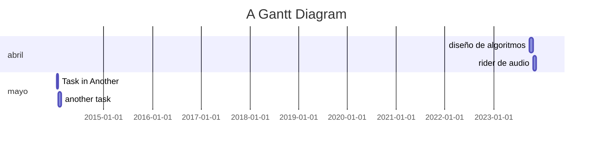
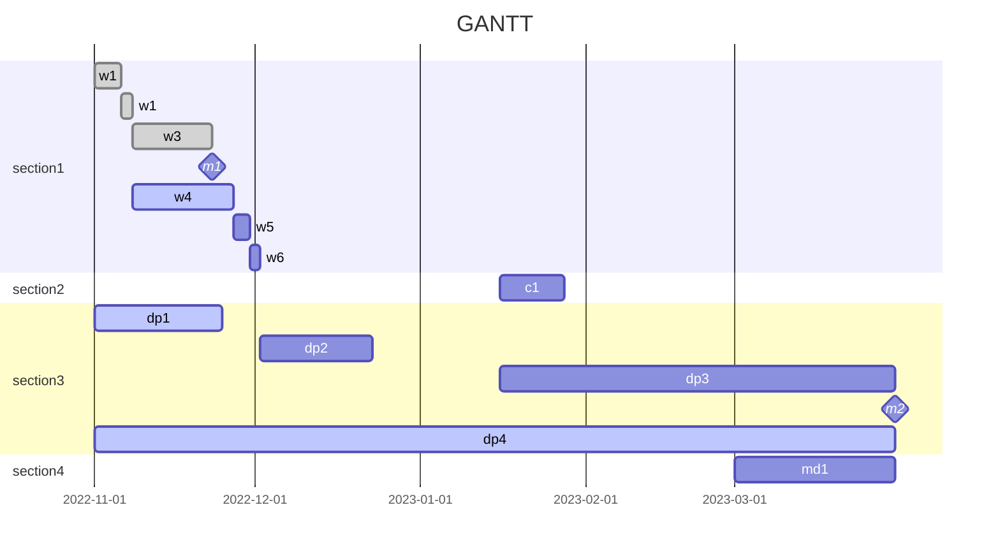

<grid drag="60 55" drop="5 10" bg="transparent" align="left">
# Proyectual
## Clase 10
</grid>

<grid drag="25 45" drop="-5 10" bg="black" align="top">
- estructura  
- diagrama de Gantt  
- latex  
- obras 
</grid>
 
<grid drag="-5 10" drop="5 -10" bg="black">
  
</grid>

<grid drag="-5 10" drop="5 -28">
<b>Ciencia y Música</b> 900 | 2025 | Carolina Di Paola</grid>

$$
\newcommand{\mat}{\blacksquare}
\newcommand{\obj}{\blacklozenge}
\newcommand{\agn}{\bullet}
\newcommand{\itf}{\leftrightarrow}
\newcommand{\ent}[1]{\boxed{#1}}
\newcommand{\branch}{\twoheadrightarrow}
$$

---
## titulo
- restringe la polisemia.
- es un puente entre la abstracción y el mundo real. 
- clickbait
### subtitulo
- nunca es redundante.
- es un espacio de complicidad entre la creación y la recepción. 
- tiene una condición de verdad pero no garantiza una sola direccionalidad del mensaje. 
- es anti-formal, puede negar o afirmar la forma. 
- tipos: nombre propio, somático, procedimiento. 

---
## síntesis
- está formada por 1 a 3 oraciones. "Es un..." (concisa)
## objetivos  
- entre 3 y 5. 
- marcar un interés principal y otros secundarios. 
---
## justificación / memoria conceptual

- razón, aporte, justificación, defensa.
### contexto
### estado del arte 

- obras específicas
- relatos relacionados
---
#### literatura comentada
- imaginario especulativo
- paradigma  
- motivación 
### paradigma
- bajo qué modelo/teoría se enmarca la obra/proyecto; conjunto de creencias/valores.
---
## descripción
### desglose o explicación de la cosa.
### principio funcionamiento 
### entorno / vínculo con el público
tipología de circulación del objeto (concierto, instalación, virtualidad, etc.)
- comportamiento del público (libre, por batches, 1 a 1)
- pre-condiciones de inicialización
- horas de apertura
---
## desarrollo
### cronograma
- etapas y por meses de trabajo  

---

---
### lista de materiales
### rider
### planos
### presupuesto

---
## referencias
### bibliografia
### teaser
### blog / bitácora
### statement

---

# Ejemplos
## titulo
- Biomachine Wind Animals
### subtitulo
- Explorando las intersecciones entre arte y ciencia desde perspectivas de escucha ecológica como nuevas estrategias para la composición musical

---
## síntesis
- Es una instalación sonora interactiva centrada en las aves acuáticas del lago Coatetelco en Morelos, México.
---
## objetivos  
- Desarrollar estrategias colaborativas entre biólogos y artistas mediante prácticas de campo para enfoques transdisciplinarios que permitan interpretar, relacionar y crear a partir de los sonidos ambientales. 
- Desarrollar prácticas de campo en contextos familiares, influenciadas por el concepto de conocimiento situado de Donna Haraway.
- Ofrecer un componente interactivo con el público que busca reflexionar sobre la relación entre los organismos humanos y no humanos y cómo estas relaciones han cambiado a lo largo del tiempo.

---
## justificación / memoria conceptual

- La relación entre el sonido, la audición y el entorno es producto de la evolución de las especies a lo largo de millones de años. Cada especie ha desarrollado su propio órgano que le permite adaptarse a las características acústicas de su entorno. En el caso de los humanos, la escucha es una de las maneras de relacionarnos con nuestro entorno y estudiarlo a través de sus sonidos. 

---
A lo largo de la historia se han utilizado diversas herramientas para imitar y estudiar los sonidos del entorno, desde instrumentos musicales hasta instrumentos de medición. 

---
En el siglo XX, el desarrollo de las tecnologías de audio permitió la captura de sonidos del entorno en soportes de reproducción fijos.

Esto permitió el estudio del entorno a partir de sus sonidos con mayor precisión, con parámetros que van más allá de la percepción humana.

---

Disciplinas como la composición musical, la musicología, la etnomusicología y la antropología nacieron del marco epistemológico imperial europeo que determina históricamente cómo escuchar, conocer y describir el mundo sonoro y las culturas auditivas globales. El marco colonial sitúa al yo en el centro para estudiar la alteridad. **El eurocentrismo histórico establece el paradigma de lo “exótico”, en el que el Sur Global no se considera parte de la “historia universal”, sino más bien en los márgenes de la periferia.**

---
Las culturas precolombinas de Mesoamérica y los Andes septentrionales poseían un profundo conocimiento de su territorio, con una perspectiva integral que combinaba enfoques artísticos y científicos. Diferentes civilizaciones desarrollaron herramientas específicas para estudiar y representar su relación con el entorno. Naturaleza, sociedad, cultura, política y religión formaban parte de una cosmovisión integral. A partir de esta perspectiva multifacética, las culturas antiguas representaban su visión del mundo mediante huellas simbólicas, como la **iconografía zoomórfica.** 

---
Las culturas antiguas mesoamericanas y andinas desarrollaron una amplia variedad de sistemas acústicos con iconografía simbólica. **Estos artefactos sonoros son herramientas semióticas para interpretar la relación biocultural con su territorio y el mundo sonoro. Los artefactos sonoros precolombinos son epistemologías de la escucha que representan huellas simbólicas de cómo la sociedad percibía su territorio acústico y se relacionaba con las culturas auditivas no humanas. La sabiduría ancestral pervive en objetos culturales en forma de memorias colectivas. **

---
Las biomáquinas son tecnologías híbridas; son cíborgs en el sentido de Haraway, no solo refiriéndose a una criatura, sino a un sistema de comunicación que problematiza el encuentro y el conflicto epistemológico entre las tecnologías antiguas y las nuevas. **La materialidad de cada dispositivo difiere de los demás, lo que señala una de las principales diferencias entre las tecnologías ancestrales y las nuevas.** 

---
Los artefactos sonoros, como los recipientes silbantes, están hechos a mano con tierra y agua del territorio de la comunidad. Son cuerpos híbridos vinculados a elementos esenciales de la Tierra, como el agua, la tierra, el fuego y el viento. Las tecnologías ancestrales son herramientas semióticas que transmiten una cosmovisión de cómo la comunidad ve, oye y habita sus territorios. La poética intrínseca de estos artefactos sonoros revela el profundo vínculo y la relación que las civilizaciones antiguas mantenían con el medio ambiente.

---
En contraste, los procesos industriales generan una desconexión con el territorio, creando una barrera entre los procesos originales de extracción mineral y el producto final, ocultando la conexión extractiva con los ecosistemas naturales y su impacto en ellos.

---

Estos artefactos son portadores de la ancestral “cosmoaudiovisión” como forma de escuchar el mundo. 
No existe una conexión lineal entre las culturas precolombinas y la actual riqueza biocultural de México, sino un complejo desarrollo sincrético y pluricultural. En el caso de artefactos sonoros como los vasos y botellas silbadoras, sus orígenes musicales se han perdido debido a la colonización. 

---
Hoy en día, solo existen como piezas de museo y recuerdos de lo que alguna vez existió en las culturas sonoras. Nuestras ocho biomáquinas se inspiraron en estos sistemas acústicos precolombinos y se crearon colectivamente con la iconografía zoomórfica de las aves estudiadas durante el trabajo de campo.

---
### contexto
Durante la década de 1970, el Proyecto Mundial de Paisajes Sonoros (WSP), reconocido internacionalmente, fue fundado por los compositores Murray Schafer, Hildegard Westerkamp, ​​Barry Truax, Bruce Davis, Peter Huse y Howard Broomfield, quienes desempeñaron un papel clave en la investigación interdisciplinaria sobre paisajes sonoros. 

---
El WSP concebía al artista o compositor como una persona formada en todas las disciplinas del sonido. Este trabajo pionero contribuyó significativamente al desarrollo posterior de campos como la ecología acústica, la ecoacústica y la biomúsica. También generó nuevos paradigmas dentro de la composición musical al integrar los sonidos del entorno. Si bien estas contribuciones han sido muy valiosas, no representan el complejo panorama de los ecosistemas del Sur Global, cuyos problemas trascienden los paradigmas occidentales.

---

Sobre Coatetelco  en la actualidad, nos referimos a un municipio indígena de habla náhuatl en Morelos, México, cuya vegetación es bosque caducifolio bajo. Tiene una población de 11.347 habitantes, de los cuales el 89% vive en la pobreza. El lago Coatetléco es fundamental para la población como recurso que sustenta las actividades bioculturales. Además de su uso agrícola, como el riego y la pesca, también es un espacio esencial para la recreación social. 

---
El lago está vinculado a la cosmovisión indígena de Coatetléco, como el vínculo indivisible entre la sociedad y la naturaleza. Esta relación se percibe en el paisaje sonoro cotidiano, donde coexisten las capas de las culturas humanas y no humanas. Si bien el canto de los pájaros es muy activo al amanecer, cuando el sol ilumina la aurora, es posible escuchar el golpeteo de los pescadores en sus barcas. Las festividades relacionadas con los santos son constantes y se pueden oír a través de los fuegos artificiales y las bandas de música. 

---
Todo forma parte del ecosistema acústico y dinámico del lago Coatetelco. Las actividades humanas de la comunidad tienen una antigua conexión con el lago y su biodiversidad desde la época prehispánica.

---

La cosmovisión indígena pervive hasta nuestros días en mitos y relatos, particularmente aquellos relacionados con la fauna local. En el caso específico del lago Coatetelco, las aves y los animales del ecosistema son muy importantes como parte de la cosmovisión y el sustento de la comunidad. Además, el lago es considerado sagrado para las comunidades indígenas; es un espacio donde habitan deidades del agua; entre ellas se encuentran los “airecitos” o pilachichinques, seres míticos encargados de atraer las lluvias. 

---
Las comunidades continúan venerando a estas deidades en la actualidad. Morelos, el tercer estado más pequeño de México, alberga un asombroso 39 % de la biodiversidad de aves del país, con un registro de 439 especies documentadas.

---

Los registros de Coatetelco indican la presencia de 200 especies de aves. El presente estudio registró 80 especies durante el trabajo de campo realizado durante la temporada migratoria invernal. De estas, 23 especies se consideran en riesgo, dos están en peligro de extinción y seis están amenazadas.

De las ocho especies que elegimos para la instalación sonora, una está amenazada, Aramus guarauna, y otra se considera prioritaria para la conservación, Pandion haliaetus.

El arte, una huella simbólica para las generaciones futuras.

---
### paradigma

#### Biomúsica
- El campo de la biomúsica intersecta el arte sonoro y las ciencias biológicas con la Objetivo: crear música nueva producida con sonidos de organismos vivos no humanos. Es un área interdisciplinaria que reúne colaboración, interacción e intercambio de conocimientos entre diferentes perspectivas del mundo sonoro. El término «biomúsica» se utilizó por primera vez en la Academia Nacional de Ciencias de Washington, D.C., en 1986.
---
Como resultado, en 2002, Patricia Gray, Bernie Krause, Luise Baptista y Roger Payne fundaron el Programa de Biomúsica como un campo de investigación para estudiar cómo los elementos biológicos y cognitivos de la creación musical se expresan en las relaciones y la construcción de significado en los sistemas de comunicación musical, tanto humanos como no humanos.⁷ Sin embargo, la biomúsica como campo creativo ya había nacido a principios del siglo XX, con colaboraciones de métodos científicos y musicales como las de Cornell Schmitt y Hans Stadler, y las de Ludwig Koch y Edward Nicholson.

---

A través de mi investigación, he dividido el amplio campo de la biomúsica en dos áreas:

- las que han surgido de las ciencias, como la bioacústica y ecoacústica

- o ecología del paisaje sonoro, y aquellas que han surgido de las artes: ecología acústica, biomusicología, zoomusicología, ecomusicología y acustemología. 
Si bien cada campo tiene un enfoque interdisciplinario, los objetivos, métodos y perspectivas se orientan más hacia las artes o las ciencias.
---
## descripción
### desglose o explicación de la cosa.

La instalación sonora reflexiona sobre cuatro perspectivas: las cosmovisiones mesoamericanas antiguas expresadas a través de la iconografía zoomórfica, la importancia ecológica y biocultural de las aves acuáticas y su ecosistema, los conceptos ancestrales del vínculo indivisible entre la sociedad y la naturaleza, y el encuentro epistemológico y el conflicto entre las tecnologías antiguas y las nuevas.

---
El proyecto combina tecnologías ancestrales inspiradas en los sistemas acústico-mecánicos precolombinos andinos y mesoamericanos, como vasijas silbadoras y botellas silbadoras. Las biomáquinas son cuerpos híbridos compuestos de artefactos sonoros mecánicos automatizados que se mueven y producen sonido en respuesta a la luz.

---

La obra de arte se inspira en la reacción acústica de las aves al encontrarse con la luz del amanecer. La instalación sonora crea una experiencia estética de escucha de entornos acuáticos naturales, evocando mundos imaginarios que relacionan la sabiduría ancestral con los enfoques científicos contemporáneos de la naturaleza.

---
### principio funcionamiento 

Las biomáquinas están automatizadas con sistemas de equilibrio biomecánico que mueven
el agua en su interior.
Los artefactos de arcilla se utilizan para activar los sistemas acústicos mediante la presión del aire. El sonido del recipiente silbador se genera cuando el agua llena la cámara acústica y provoca que la presión del aire active el sistema acústico de los silbatos internos.

---
### entorno / vínculo con el público
Inspirada en nuestra investigación de campo nocturna en busca de aves acuáticas con una linterna entre los juncos, la instalación sonora invita al público a interactuar con el espacio y las biomáquinas en la oscuridad. El público camina libremente por una sala oscura con la luz de sus teléfonos móviles, buscando el contacto con las biomáquinas. Cuando la luz encuentra el sensor, el movimiento se activa, generando un sistema de equilibrio que dispara el sonido de las biomáquinas.

---
## desarrollo

La obra examina el papel de la tecnología en la comprensión y utilización de los paisajes sonoros, particularmente en países biodiversos y pluriculturales como México. A partir de trabajo de campo, se llevan a cabo prácticas colaborativas con músicos y biólogos para estudiar los sonidos de ecosistemas específicos. 

---
### cronograma

- La metodología combina estrategias de biología, bioacústica, ecología acústica y etnografía en cinco etapas. La primera etapa incluye investigación de campo en colaboración con biólogos: estudio del territorio acústico mediante prácticas de escucha, monitoreo acústico automatizado y grabación de campo. La segunda etapa incluye la identificación audiovisual de especies, así como diarios de campo. 

---

La tercera etapa se centra en el análisis de los datos acústicos en el estudio, la identificación de especies mediante la escucha, el análisis espectrográfico, la evaluación de especies, la descripción y la clasificación del paisaje sonoro. La tercera etapa incluye la selección del material y el diseño creativo para la transformación de los medios. La última etapa comprende el proceso creativo de transferencia del trabajo de campo a la obra de arte.

---

## Sonidos del Antropoceno

<iframe width="560" height="315" src="https://www.youtube.com/embed/4km5eb2EWOw?si=yPlOHfbQ-PnzEqHl" title="YouTube video player" frameborder="0" allow="accelerometer; autoplay; clipboard-write; encrypted-media; gyroscope; picture-in-picture; web-share" referrerpolicy="strict-origin-when-cross-origin" allowfullscreen></iframe>

---

<iframe width="560" height="315" src="https://www.youtube.com/embed/xIeiPr9V3BU?si=-wz6QnKrpjo4N500" title="YouTube video player" frameborder="0" allow="accelerometer; autoplay; clipboard-write; encrypted-media; gyroscope; picture-in-picture; web-share" referrerpolicy="strict-origin-when-cross-origin" allowfullscreen></iframe>

---
## ALMA

<iframe title="vimeo-player" src="https://player.vimeo.com/video/195339056?h=4e259118e0" width="640" height="360" frameborder="0" referrerpolicy="strict-origin-when-cross-origin" allow="autoplay; fullscreen; picture-in-picture; clipboard-write; encrypted-media; web-share"   allowfullscreen></iframe>

---

<iframe title="vimeo-player" src="https://player.vimeo.com/video/170847460?h=3fd10607ad" width="640" height="360" frameborder="0" referrerpolicy="strict-origin-when-cross-origin" allow="autoplay; fullscreen; picture-in-picture; clipboard-write; encrypted-media; web-share"   allowfullscreen></iframe>

---

