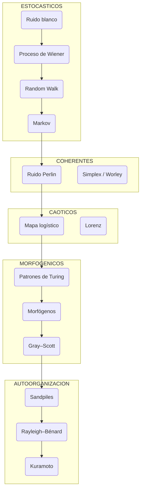
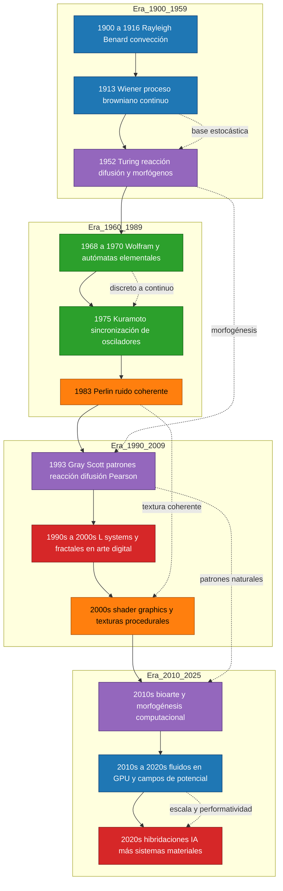

taxonomía ordenada de sistemas dinámicos, físicos o computacionales que se usan como modelos tanto en ciencia como en artes electrónicas/mediales. 

El criterio: ir de lo más simple (procesos aleatorios básicos, autómatas sencillos) hacia lo más complejo (sistemas no lineales con autoorganización, inestabilidades fluidas, morfogénesis, híbridos físico-computacionales). 

1. Ruido blanco (procesos estocásticos básicos)
2. [[proceso de Wiener]] (formalización matemática del movimiento browniano continuo)
3. [[Movimiento browniano]] / [[random walk]]
4. [[distribución probabilística]] (Gauss, Poisson, etc.)
5. Procesos de Markov [[Hidden Markov Models (HMM)]]
6. Sistemas de autómatas celulares elementales (Wolfram, Rule 30)
7. Ruido coherente ([[perlin noise]],Simplex, Worley)
8. Mapas logísticos (bifurcación, caos determinista simple)
9. Percolación (clusters y umbrales críticos)
10. [[Agregación limitada por difusión]] (DLA)
11. [[l-systems]] (sistemas de Lindenmayer para crecimiento fractal)
12. Autómatas celulares bidimensionales (Game of Life, Langton’s Ant)
13. Funciones iteradas fractales (Mandelbrot, Julia)
14. Sistemas multiagente simples (boids de Reynolds)
15. Autómatas estocásticos continuos (Random Boolean Networks de Kauffman)
16. [[máquinas de Boltzmann]](energía libre y sampling probabilístico)
17. [[patrones de Turing]] (modelos de reacción–difusión)
18. [[morfógenos]] (difusores químicos o virtuales que generan morfología)
19. Modelo Gray–Scott (reacción–difusión no lineal con oscilaciones espaciales)
20. Campos de potencial y autómatas morfofénicos (morphons / morphofenes)
21. Dinámica de arenas (sandpiles, autoorganización crítica)
22. Sistemas de ondas de Belousov–Zhabotinsky (osciladores químicos)
23. Dinámica de flocking avanzado (Craig Reynolds extendido, enjambres)
24. Redes neuronales continuas (Hopfield, Kohonen, primeras ANN artísticas)
25. Transformaciones energéticas básicas (ecuaciones de balance energía-flujo)
26. Dinámica de fluidos simplificada (Navier–Stokes discretizado en GPU)
27. [[inestabilidad de Kelvin-Helmholz]] (vórtices en fluidos estratificados)
28. Inestabilidad de Rayleigh–Bénard (convección térmica autoorganizada)
29. Inestabilidad de Taylor–Couette (turbulencia en cilindros rotantes)
30. Sistemas de partículas híbridos (fluido+partículas+campos magnéticos)
31. Redes de osciladores acoplados (Kuramoto, sincronización)
32. Morfogénesis bio-inspirada (sistemas híbridos físico-biológicos)
33. Hiperorganismos híbridos (IA embebida + sistemas materiales no lineales)

## taxonomía
- 1–5: aleatoriedad básica, probabilidad y autómatas simples → útiles en visualizaciones mínimas, generadores de ruido, composiciones algorítmicas tempranas.
- 6–12: caos, fractales y autoorganización discreta → base en artes digitales desde los 80 (fractal music, gráficos generativos).
- 13–20: redes, modelos energéticos y reacción-difusión → base de visuales bioinspirados, arte generativo con autoorganización.
- 21–28: redes neuronales y dinámica fluida compleja → pasaje a sistemas de mayor realismo físico y cognitivo.
- 29–30: bio-híbridos y sistemas especulativos con IA → lo más complejo, donde la frontera entre arte, ciencia y vida artificial se vuelve performativa.

## Relaciones conceptuales

Tipo de sistema	Ejemplo / Representante	Naturaleza	Dominio de aplicación
Estocástico discreto	Ruido blanco, Random walk, Wiener	Probabilidad pura	Síntesis de textura, aleatoriedad musical
Ruido coherente	Perlin, Simplex, Worley	Determinismo local, continuidad espacial	Terreno, viento, osciladores suaves
Caos determinista	Mapas logísticos, Lorenz, Henon	Sensibilidad a condiciones iniciales	Música caótica, visuales no lineales
Autoorganización química	Patrones de Turing, Gray–Scott	Reacción–difusión, morfogénesis	Morfogénesis, biología teórica, bioarte
Morfogénesis simbólica	L-systems, Morphons	Crecimiento, replicación	Generación procedural, bio-simulación
Dinamismo físico no lineal	Rayleigh–Bénard, Taylor–Couette	Fluido + energía + simetría rota	Sonificación térmica, instalaciones cinéticas
Cognición material	Hopfield, Kuramoto, morphons híbridos	Adaptación, sincronía	IA bioinspirada, arte especulativo

---

## Resumen conceptual
- Wiener (1913) → continuidad del ruido, base matemática de los procesos Brownianos.
- Perlin (1983) → coherencia espacial: el ruido se convierte en textura.
- Turing (1952) → el ruido químico se convierte en forma morfogenética.
- Morfógenos (1950s–presente) → el patrón se convierte en organismo.

---

| Campo | Nombre genérico | Ejemplo representativo |
|--------|-----------------|------------------------|
| **Matemática** | Procesos estocásticos / Campos aleatorios | Wiener, Perlin, Markov |
| **Física** | Sistemas dinámicos no lineales | Rayleigh–Bénard, Lorenz, Taylor–Couette |
| **Biología** | Sistemas de reacción–difusión / Morfogénesis | Turing, Gray–Scott, morphogens |
| **Computación** | Sistemas generativos / Modelos procedurales | Perlin noise, L-systems, shaders |
| **Teoría de la complejidad** | Sistemas complejos adaptativos | Kuramoto, boids, autómatas celulares |
| **Diseño y arte generativo** | Sistemas dinámicos paramétricos | Modelos sonoros, visuales o híbridos controlados por parámetros |

# impacto de sistemas dinámicos en la cultura popular

| Modelo científico / matemático | Principio dinámico | Aplicación en software y cultura visual | Ejemplos concretos |
|--------------------------------|--------------------|----------------------------------------|--------------------|
| **Ruido blanco / Gaussiano / Perlin** | Aleatoriedad coherente y campos correlacionados | Síntesis de texturas naturales, cielos, humo, piel, terreno, fuego | Photoshop: *Filter → Noise*, *Clouds*; After Effects: *Fractal Noise*; videojuegos y CGI (Terragen, Blender, Unity shaders) |
| **Procesos estocásticos (Wiener, Browniano)** | Movimiento aleatorio continuo, difusión | Simulación de polvo, partículas, fluidos ligeros, “grano” cinematográfico | Houdini, Maya, After Effects *Turbulent Displace*; filtros de cine (*film grain*) |
| **Mapas logísticos y caos determinista** | Bifurcaciones, sensibilidad a condiciones iniciales | Generación procedural de eventos caóticos, variación no repetitiva | Música generativa (Xenakis, Brian Eno), visuales fractales, videojuegos *No Man’s Sky* |
| **Autómatas celulares (Wolfram, Game of Life)** | Reglas locales → patrones globales emergentes | Generación procedural, patrones autoorganizados, simulaciones biológicas | Minecraft (mecánicas de bloques), simulaciones de colonias, efectos de crecimiento o propagación en animación |
| **L-systems (Lindenmayer)** | Reglas de crecimiento fractal | Modelado de plantas, vegetación y geometrías orgánicas | Blender Geometry Nodes, Houdini, SpeedTree, fractales de paisajes en videojuegos |
| **Reacción–difusión (Turing, Gray–Scott)** | Autoorganización por interacción química | Texturas animales, mármoles, patrones epidérmicos, camuflaje digital | Shaders GLSL, Substance Designer (*masks procedurales*), bioarte (Pearson, Somorjai) |
| **Sistemas de partículas y campos vectoriales** | Movimiento continuo de agentes en campos de fuerza | Simulaciones físicas, humo, fuego, multitudes, fluidos visuales | After Effects *Particular*, Houdini *POP solver*, Unity Particle Systems |
| **Redes de osciladores (Kuramoto)** | Sincronización y fase colectiva | Dinámicas rítmicas y coreográficas, efectos de sincronía | Sistemas de audio-reactividad, instalaciones cinéticas, música electrónica (LFOs sincronizados) |
| **Dinámica de fluidos (Navier–Stokes discretizado)** | Advección, difusión, vorticidad | Simulación hiperreal de agua, aire, fuego, humo | Blender *Mantaflow*, RealFlow, Houdini *FLIP solver*, motores físicos de GPU |
| **Patrones fractales (Mandelbrot, Julia)** | Auto-similitud y escala infinita | Estética fractal en diseño, logos, motion graphics | Cultura digital 90s, *Electric Sheep*, fractal wallpapers, visualizadores de audio |
| **Modelos de arena / criticalidad autoorganizada** | Equilibrio entre estabilidad y colapso | Simulación de derrumbes, montañas, sistemas de cascada, redes | Houdini VEX, engines de destrucción, visualizaciones de datos de “cascadas críticas” |
| **Simulación de agentes (boids de Reynolds)** | Reglas locales simples → comportamiento colectivo | Flocking, enjambres, multitudes, danza computacional | Crowd simulation (Maya, Houdini), animaciones de bandadas, IA básica de videojuegos |
| **Reacción no lineal + feedback** | Realimentación continua → estabilidad oscilante | Sistemas visuales autoorganizados y feedback de video | Visuales analógicos, Hydra.js, feedbacks de cámara o shader |
| **Campos de potencial / morphons (Deacon, Hoffmeyer)** | Formas emergentes por interacción simbólica o energética | Bioarte, escultura algorítmica, diseño de materiales “vivos” | Instalaciones biohíbridas, arte generativo especulativo (Eduardo Kac, Pinar Yoldas) |
