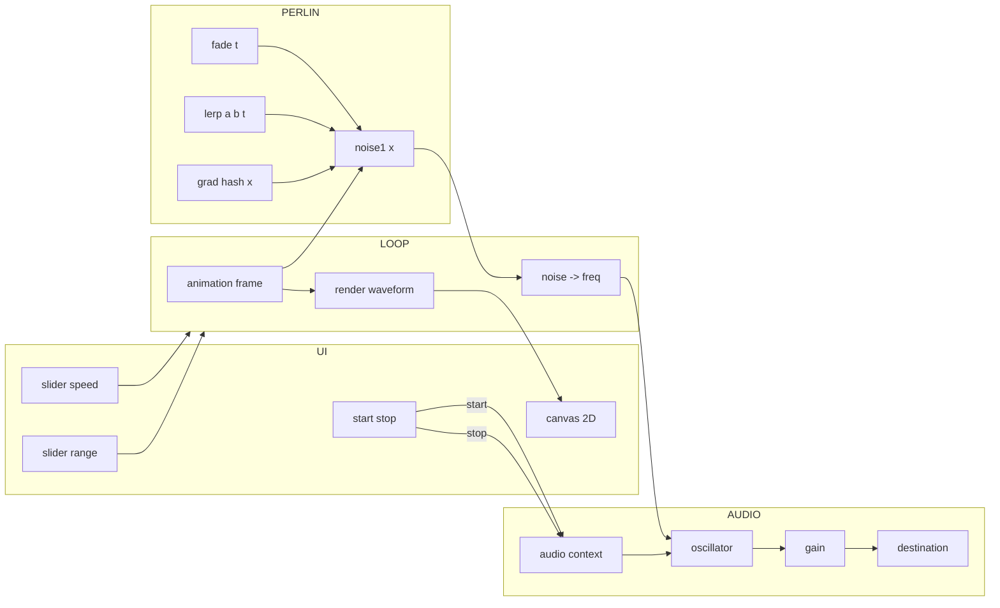

## perlin noise

```dataviewjs
// PERLIN NOISE 1D — visual + sonificación (≈90 líneas) con Start/Stop
const root = this.container; root.innerHTML = "";
const ui = document.createElement("div");
ui.style = "display:grid;gap:.6rem;font:13px system-ui";
root.appendChild(ui);

// UI
const btn = document.createElement("button");
btn.textContent = "Start";
btn.style = "padding:.55rem .9rem;border:1px solid var(--background-modifier-border);border-radius:8px;background:var(--background-secondary);cursor:pointer";
const lab1 = document.createElement("label");
const sSpeed = document.createElement("input");
lab1.textContent = "SPEED 1.0";
sSpeed.type = "range"; sSpeed.min = "0.1"; sSpeed.max = "5"; sSpeed.step = "0.1"; sSpeed.value = "1";
const lab2 = document.createElement("label");
const sRange = document.createElement("input");
lab2.textContent = "RANGE 200 Hz";
sRange.type = "range"; sRange.min = "0"; sRange.max = "800"; sRange.step = "10"; sRange.value = "200";
sSpeed.style.width = "100%"; sRange.style.width = "100%";
ui.append(btn, lab1, sSpeed, lab2, sRange);

// Canvas
const c = document.createElement("canvas"); c.width = 900; c.height = 240;
c.style = "width:100%;height:auto;border:1px solid var(--background-modifier-border);border-radius:8px;background:black";
ui.appendChild(c);
const g = c.getContext("2d");

// Perlin 1D: tabla permutada duplicada
var p = [151,160,137,91,90,15,131,13,201,95,96,53,194,233,7,225,140,36,103,30,69,142,8,99,37,240,21,10,23,190,6,148,247,120,234,75,0,26,197,62,94,252,219,203,117,35,11,32,57,177,33,88,237,149,56,87,174,20,125,136,171,168,68,175,74,165,71,134,139,48,27,166,77,146,158,231,83,111,229,122,60,211,133,230,220,105,92,41,55,46,245,40,244,102,143,54,65,25,63,161,1,216,80,73,209,76,132,187,208,89,18,169,200,196,135,130,116,188,159,86,164,100,109,198,173,186,3,64,52,217,226,250,124,123,5,202,38,147,118,126,255,82,85,212,207,206,59,227,47,16,58,17,182,189,28,42,223,183,170,213,119,248,152,2,44,154,163,70,221,153,101,155,167,43,172,9,129,22,39,253,19,98,108,110,79,113,224,232,178,185,112,104,218,246,97,228,251,34,242,193,238,210,144,12,191,179,162,241,81,51,145,235,249,14,239,107,49,192,214,31,181,199,106,157,184,84,204,176,115,121,50,45,127,4,150,254];
var P = p.concat(p);
function fade(t){ return t*t*t*(t*(t*6-15)+10); }
function lerp(a,b,t){ return a+(b-a)*t; }
function grad(h,x){ return (h&1)? x : -x; }
function noise1(x){
  var X = Math.floor(x)&255; var xf = x - Math.floor(x);
  var u = fade(xf);
  var a = P[X], b = P[(X+1)&255];
  return lerp(grad(a, xf), grad(b, xf-1), u); // [-1,1]
}

// Audio
let AC = null, osc = null, out = null, running = false, raf = null, t = 0;
async function startAudio(){
  if (AC && AC.state !== "closed") return;
  AC = new (window.AudioContext || window.webkitAudioContext)();
  osc = AC.createOscillator(); out = AC.createGain();
  osc.type = "sine"; out.gain.value = 0.12;
  osc.connect(out).connect(AC.destination); osc.start();
}
async function stopAudio(){
  try{ if(osc) osc.disconnect(); if(out) out.disconnect(); }catch(e){}
  try{ if(AC && AC.state !== "closed") await AC.close(); }catch(e){}
  AC = null; osc = null; out = null;
}
sSpeed.oninput = function(){ lab1.textContent = "SPEED " + (+sSpeed.value).toFixed(1); };
sRange.oninput = function(){ lab2.textContent = "RANGE " + sRange.value + " Hz"; };

// Loop
function step(){
  if (!running) return;
  var speed = +sSpeed.value, range = +sRange.value, base = 220;
  t += speed * 0.008;
  g.fillStyle = "rgba(0,0,0,0.15)"; g.fillRect(0,0,c.width,c.height);
  g.beginPath(); g.lineWidth = 2;
  g.strokeStyle = "hsl(" + (200 + Math.sin(t)*60) + ",90%,65%)";
  for (var ix=0; ix<c.width; ix++){
    var n = noise1(t + ix*0.01);
    var yy = c.height*(0.5 - 0.45*n);
    if (ix===0) g.moveTo(ix,yy); else g.lineTo(ix,yy);
  }
  g.stroke();
  if (osc){
    var n0 = noise1(t + (c.width*0.5)*0.01);
    var f = Math.max(40, Math.min(2000, base + range*n0));
    try{ osc.frequency.setTargetAtTime(f, AC.currentTime, 0.03); }catch(e){}
  }
  raf = requestAnimationFrame(step);
}

// Toggle
btn.onclick = async function(){
  if (!running){
    await startAudio(); if (AC.state==="suspended") await AC.resume();
    running = true; btn.textContent = "Stop";
    if (!raf) raf = requestAnimationFrame(step);
  } else {
    running = false; btn.textContent = "Start";
    if (raf) cancelAnimationFrame(raf); raf = null;
    await stopAudio();
  }
};
window.addEventListener("beforeunload", async function(){
  running = false; if (raf) cancelAnimationFrame(raf); raf = null; await stopAudio();
});
```




El Perlin 1D devuelve valores en [-1, 1]; los uso para dibujar y para modular la frecuencia alrededor de 220 Hz con un rango ajustable.

- El slider SPEED mueve el cursor temporal del ruido, lo que cambia a la vez el dibujo y el pitch.
- El toggle garantiza matar la instancia de WebAudio al parar


## rw vs pn
son dos modelos de aleatoriedad continua, pero con estructuras estadísticas y temporales muy distintas.

--- 

1. Random walk (paseo aleatorio)
- Definición:
Es una suma acumulativa de pasos aleatorios independientes.
Cada nuevo valor depende del anterior + un número aleatorio:
$$x_{t+1} = x_t + \epsilon_t,$$
donde $\epsilon_t$ es ruido blanco (uniforme o gaussiano).
- Características:
- Es un proceso estocástico acumulativo (tipo ruido Browniano).
- No tiene límite: tiende a derivar (drift) hacia valores cada vez mayores o menores.
- Su espectro es de ruido 1/f², es decir, tiene más energía en frecuencias bajas.
- No tiene “textura espacial” coherente: solo continuidad por inercia.
- Ejemplo auditivo:
Un tono que sube y baja con pasos impredecibles pero suaves — como un borracho que no repite caminos pero tampoco da saltos bruscos.
- Ejemplo visual:
Una línea que serpentea libremente sin patrón aparente.

--- 

2. Perlin noise
- Definición:
Es una función determinista de coordenadas, inventada por Ken Perlin (1983) para generar texturas naturales.
No acumula pasos, sino que interpola gradientes pseudoaleatorios entre puntos de una grilla.
Matemáticamente:
$$n(x) = \text{interpolación}\big(\langle g_i, x - i\rangle\big),$$
donde $g_i$ son gradientes aleatorios y $\langle\cdot\rangle$ es el producto punto.
- Características:
- Es suave y diferenciable: derivadas continuas hasta cierto orden.
- No deriva como el random walk: siempre está acotado entre −1 y 1.
- Permite control de escala (“zoom” espacial o temporal).
- Al sumarse en octavas da lugar al clásico fractal noise o turbulence.
- Es ruido espacial coherente, no temporal acumulativo.
- Ejemplo auditivo:
Un timbre que fluctúa orgánicamente, como el viento o el mar, sin tendencia ni saltos duros.
- Ejemplo visual:
Nubes, montañas, humo, texturas naturales (usadas en shaders, CGI, etc.).

--- 

3. Comparación directa

Propiedad	Random Walk	Perlin Noise
Tipo de proceso	Estocástico acumulativo	Función determinista pseudoaleatoria
Continuidad	Continua en posición, no en derivada	Continua y suave (suaves derivadas)
Acotación	No acotado, deriva libremente	Acotado (−1 a 1)
Correlación	Muy local (por acumulación)	Coherencia global y espacial
Reproducibilidad	No, depende de la secuencia aleatoria	Sí, con misma permutación de gradientes
Espectro	1/f² (browniano)	1/f (dependiendo de octavas)
Aplicaciones	Caminatas, difusión, simulación de partículas	Texturas, paisajes, osciladores orgánicos


--- 

Resumen mental rápido
- Random walk → “ruido acumulado”: deriva, como una caminata borracha.
- Perlin noise → “ruido coherente”: parece natural y ondulante, como un paisaje o viento.

--- 

Aplicación musical
- El random walk genera melodías impredecibles (improvisación o glissandos aleatorios).
- El Perlin noise genera modulaciones orgánicas (LFOs suaves, osciladores de textura viva).


```dataviewjs
// Three.js + Perlin Particles + Wind Sonification + Reverb 70% wet
// - FIX: resize seguro de partículas (trails, lines, filtros) al cambiar el slider
// - Reverb: convolver con IR sintético, wet=0.7 / dry=0.3

const root=this.container; root.innerHTML="";
const ui=document.createElement("div"); ui.style="display:grid;gap:.6rem;font:13px system-ui"; root.appendChild(ui);

function mkSlider(label, min,max,step,val,fmt=(x)=>x){ const wrap=document.createElement("div"); wrap.style="display:grid;gap:.3rem"; const lab=document.createElement("div"); lab.textContent=`${label}: ${fmt(val)}`; const s=document.createElement("input"); Object.assign(s,{type:"range",min,max,step,value:val}); s.style.width="100%"; s.oninput=()=>lab.textContent=`${label}: ${fmt(+s.value)}`; wrap.append(lab,s); return {wrap,lab,s}; }

const btn=document.createElement("button"); btn.textContent="Start"; btn.style="padding:.55rem .9rem;border:1px solid var(--background-modifier-border);border-radius:8px;background:var(--background-secondary);cursor:pointer";
const pCount = mkSlider("Particles", 4, 480, 1, 24);
const pSpeed = mkSlider("Speed", 0.1, 3, 0.1, 1, v=>v.toFixed(1));
const pScale = mkSlider("Scale", 10, 150, 1, 60);
const pTrail = mkSlider("TrailLen", 1, 20, 1, 10);
const aGain  = mkSlider("Audio Gain", 0, 1, 0.01, 0.3, v=>v.toFixed(2));
ui.append(btn, pCount.wrap, pSpeed.wrap, pScale.wrap, pTrail.wrap, aGain.wrap);

const host=document.createElement("div"); host.style="position:relative;width:100%;aspect-ratio:16/9;background:#000;border:1px solid var(--background-modifier-border);border-radius:8px;overflow:hidden"; ui.appendChild(host);

// ---- load three ----
async function loadThree(){ if(window.THREE) return; await new Promise((res,rej)=>{ const s=document.createElement("script"); s.src="https://unpkg.com/three@0.157.0/build/three.min.js"; s.onload=res; s.onerror=()=>rej(new Error("CSP bloqueó Three.js")); document.head.appendChild(s); }); }

// ---- perlin 3D ----
const P=[151,160,137,91,90,15,131,13,201,95,96,53,194,233,7,225,140,36,103,30,69,142,8,99,37,240,21,10,23,190,6,148,247,120,234,75,0,26,197,62,94,252,219,203,117,35,11,32,57,177,33,88,237,149,56,87,174,20,125,136,171,168,68,175,74,165,71,134,139,48,27,166,77,146,158,231,83,111,229,122,60,211,133,230,220,105,92,41,55,46,245,40,244,102,143,54,65,25,63,161,1,216,80,73,209,76,132,187,208,89,18,169,200,196,135,130,116,188,159,86,164,100,109,198,173,186,3,64,52,217,226,250,124,123,5,202,38,147,118,126,255]; const perm=P.concat(P);
function fade(t){return t*t*t*(t*(t*6-15)+10);} function lerp(a,b,t){return a+(b-a)*t;}
function grad(h,x,y,z){const hh=h&15; const u=hh<8?x:y; const v=hh<4?y:(hh===12||hh===14?x:z); return ((hh&1)?-u:u)+((hh&2)?-v:v);}
function noise3(x,y,z){const X=Math.floor(x)&255,Y=Math.floor(y)&255,Z=Math.floor(z)&255; x-=Math.floor(x); y-=Math.floor(y); z-=Math.floor(z); const u=fade(x),v=fade(y),w=fade(z); const A=perm[X]+Y,AA=perm[A]+Z,AB=perm[A+1]+Z; const B=perm[X+1]+Y,BA=perm[B]+Z,BB=perm[B+1]+Z; return lerp( lerp( lerp(grad(perm[AA],x,y,z), grad(perm[BA],x-1,y,z), u), lerp(grad(perm[AB],x,y-1,z), grad(perm[BB],x-1,y-1,z), u), v), lerp( lerp(grad(perm[AA+1],x,y,z-1), grad(perm[BA+1],x-1,y,z-1), u), lerp(grad(perm[AB+1],x,y-1,z-1), grad(perm[BB+1],x-1,y-1,z-1), u), v), w); }

// ---- audio ----
let AC=null, noiseSrc=null, master=null, wetGain=null, dryGain=null, convolver=null;
let filters=[]; // 1 biquad por partícula

function mkNoiseBuffer(ctx,lenSec=2){ const len=Math.floor(ctx.sampleRate*lenSec); const buf=ctx.createBuffer(1,len,ctx.sampleRate); const d=buf.getChannelData(0); for(let i=0;i<len;i++) d[i]=Math.random()*2-1; return buf; }
function mkImpulse(ctx, dur=2.5, decay=3.0){
  const len=Math.floor(ctx.sampleRate*dur); const ir=ctx.createBuffer(2,len,ctx.sampleRate);
  for(let ch=0; ch<2; ch++){ const data=ir.getChannelData(ch); for(let i=0;i<len;i++){ const t=i/len; data[i]=(Math.random()*2-1)*Math.pow(1-t, decay); } }
  return ir;
}
async function startAudio(){
  if(AC && AC.state!=="closed") return;
  AC=new (window.AudioContext||window.webkitAudioContext)();
  // master and wet/dry
  master=AC.createGain(); master.gain.value=+aGain.s.value;
  dryGain=AC.createGain(); dryGain.gain.value=0.3;
  wetGain=AC.createGain(); wetGain.gain.value=0.7;
  convolver=AC.createConvolver(); convolver.buffer=mkImpulse(AC,2.8,3.0);

  // routing: sum(dry) -> master -> destination; sum(wet) -> master -> destination
  dryGain.connect(master); convolver.connect(wetGain).connect(master);
  master.connect(AC.destination);

  // source noise
  noiseSrc=AC.createBufferSource(); noiseSrc.buffer=mkNoiseBuffer(AC,2); noiseSrc.loop=true;
}
async function stopAudio(){
  try{ if(noiseSrc) noiseSrc.stop(); }catch{}
  try{ filters.forEach(f=>{ try{f.disconnect();}catch{} }); }catch{}
  try{ if(dryGain) dryGain.disconnect(); if(wetGain) wetGain.disconnect(); if(convolver) convolver.disconnect(); if(master) master.disconnect(); }catch{}
  try{ if(AC && AC.state!=="closed") await AC.close(); }catch{}
  AC=noiseSrc=master=wetGain=dryGain=convolver=null; filters=[];
}

// ---- three scene ----
let renderer=null, scene=null, camera=null, points=null, trails=[], trailLines=[];
let running=false, raf=null, t=0, currentN=0;

function initThree(){
  const {clientWidth}=host;
  renderer=new THREE.WebGLRenderer({antialias:true});
  renderer.setSize(clientWidth, clientWidth*9/16, false);
  renderer.setPixelRatio(Math.min(2, window.devicePixelRatio||1));
  renderer.setClearColor(0x000000,1);
  host.appendChild(renderer.domElement);

  scene=new THREE.Scene();
  camera=new THREE.PerspectiveCamera(55, renderer.domElement.width/renderer.domElement.height, 0.1, 1000);
  camera.position.set(0,0,220);

  window.addEventListener('resize', onResize);
  function onResize(){ const w=host.clientWidth, h=w*9/16; renderer.setSize(w,h,false); camera.aspect=w/h; camera.updateProjectionMatrix(); }
}

function ensureParticleCount(n){
  if(currentN===n && points && trails.length===n && trailLines.length===n && filters.length===n) return;

  // geometry for points
  if(points){ scene.remove(points); points.geometry.dispose(); points.material.dispose(); }
  const geo=new THREE.BufferGeometry(); const pos=new Float32Array(n*3); geo.setAttribute('position', new THREE.BufferAttribute(pos,3));
  const mat=new THREE.PointsMaterial({color:0x66ccff, size:3, sizeAttenuation:true, transparent:true, opacity:0.9});
  points=new THREE.Points(geo,mat); scene.add(points);

  // trails
  trailLines.forEach(l=>{ scene.remove(l); l.geometry.dispose(); l.material.dispose?.(); });
  trailLines=[]; trails=Array.from({length:n},()=>[]);
  const lmat=new THREE.LineBasicMaterial({color:0x00ffaa, transparent:true, opacity:0.5});
  for(let i=0;i<n;i++){
    const lgeo=new THREE.BufferGeometry(); lgeo.setAttribute('position', new THREE.BufferAttribute(new Float32Array(+pTrail.s.value*3),3));
    const line=new THREE.Line(lgeo,lmat); scene.add(line); trailLines.push(line);
  }

  // audio filters per particle
  if(AC){
    filters.forEach(f=>{ try{f.disconnect();}catch{} });
    filters=[];
    for(let i=0;i<n;i++){
      const bp=AC.createBiquadFilter(); bp.type="bandpass"; bp.Q.value=20; bp.frequency.value=800;
      // routing: noise -> bp -> dry & wet (convolver)
      noiseSrc.connect(bp);
      bp.connect(dryGain);
      bp.connect(convolver);
      filters.push(bp);
    }
  }
  currentN=n;
}

function updateScene(dt){
  const n=+pCount.s.value, scale=+pScale.s.value, speed=+pSpeed.s.value*0.15;
  ensureParticleCount(n);

  t += dt*speed;
  const positions=points.geometry.attributes.position.array;
  for(let i=0;i<n;i++){
    const nx = noise3(i*7.3 + t, i*1.9, 0.5+t*0.2);
    const ny = noise3(i*2.1, i*5.7 + t, 1.3+t*0.15);
    const nz = noise3(i*3.7, i*4.1, t*0.25 + i*0.33);
    const x = nx*scale, y = ny*scale, z = nz*scale;

    positions[i*3+0]=x; positions[i*3+1]=y; positions[i*3+2]=z;

    // trails safe push
    const history=trails[i]; if(history){ history.push(new THREE.Vector3(x,y,z)); while(history.length > +pTrail.s.value) history.shift(); }

    const line=trailLines[i];
    if(line){
      const arr=line.geometry.attributes.position.array;
      const L=Math.min(history.length, +pTrail.s.value);
      for(let k=0;k<L;k++){ const v=history[k]; arr[k*3+0]=v.x; arr[k*3+1]=v.y; arr[k*3+2]=v.z; }
      for(let k=L;k<+pTrail.s.value;k++){ arr[k*3+0]=x; arr[k*3+1]=y; arr[k*3+2]=z; }
      line.geometry.attributes.position.needsUpdate=true;
    }

    // audio mapping
    if(filters[i] && AC){
      const f = 200 + ((x/scale)*0.5 + 0.5) * 1800; // 200..2000
      const q = 5 + ((y/scale)*0.5 + 0.5) * 25;     // 5..30
      const g = Math.max(0.05, 0.1 + ((z/scale)*0.5 + 0.5) * 0.9); // gain perceptual
      try{
        filters[i].frequency.setTargetAtTime(f, AC.currentTime, 0.05);
        filters[i].Q.setTargetAtTime(q, AC.currentTime, 0.05);
        // algunos navegadores ignoran gain en bandpass; queda por compatibilidad
      }catch{}
      // ajustar balance global vía master
      if(master) master.gain.setTargetAtTime(+aGain.s.value, AC.currentTime, 0.05);
    }
  }
  points.geometry.attributes.position.needsUpdate=true;
}

function animate(ms){
  if(!running) return;
  if(!animate.last) animate.last=ms;
  const dt=(ms-animate.last)/1000; animate.last=ms;
  updateScene(dt);
  renderer.render(scene,camera);
  raf=requestAnimationFrame(animate);
}

// ---- lifecycle ----
async function startAll(){
  try{ await loadThree(); }catch(e){ host.innerHTML="<div style='color:#f66;padding:1rem'>Three.js bloqueado por CSP. Pido permiso o uso versión Canvas2D.</div>"; return; }
  if(!renderer){
    initThree();
    scene.add(new THREE.AmbientLight(0xffffff,0.5));
    const dl=new THREE.DirectionalLight(0xffffff,0.4); dl.position.set(1,1,1); scene.add(dl);
  }
  await startAudio(); if(AC.state==="suspended") await AC.resume();
  // reconstruir fuente de ruido fresca y filtros
  if(noiseSrc){ try{ noiseSrc.stop(); }catch{} }
  noiseSrc=AC.createBufferSource(); noiseSrc.buffer=mkNoiseBuffer(AC,2); noiseSrc.loop=true;

  ensureParticleCount(+pCount.s.value); // crea filtros y malla
  if(!noiseSrc.started){ try{ noiseSrc.start(); noiseSrc.started=true; }catch{} }

  running=true; btn.textContent="Stop";
  raf=requestAnimationFrame(animate);
}

async function stopAll(){
  running=false;
  if(raf) cancelAnimationFrame(raf); raf=null;

  // limpiar three renderer (dejamos instancia para relayout si querés)
  try{ /* keep renderer to avoid reload jitter */ }catch{}
  // audio off
  await stopAudio();
  btn.textContent="Start";
}

btn.onclick=async()=>{ if(!running) await startAll(); else await stopAll(); };
aGain.s.oninput=()=>{ if(master) master.gain.value=+aGain.s.value; };

// ajustar trails en vivo sin romper buffers
pTrail.s.oninput=()=>{ 
  if(!trailLines.length) return;
  for(let i=0;i<trailLines.length;i++){
    const line=trailLines[i];
    const newLen=+pTrail.s.value;
    const arr=new Float32Array(newLen*3);
    const hist=trails[i]||[];
    for(let k=0;k<Math.min(newLen,hist.length);k++){ const v=hist[k]; arr[k*3]=v.x; arr[k*3+1]=v.y; arr[k*3+2]=v.z; }
    line.geometry.setAttribute('position', new THREE.BufferAttribute(arr,3));
  }
};

// safety
window.addEventListener("beforeunload", async()=>{ if(running) await stopAll(); });
```


