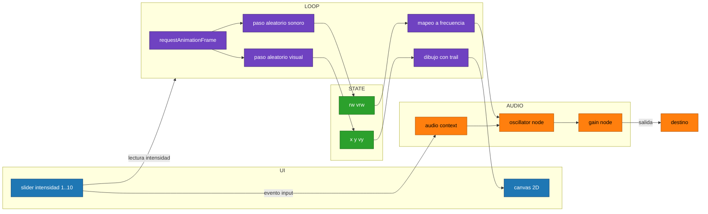

```dataviewjs
// RANDOM WALK con toggle Start/Stop (seguro para WebAudio)
// ---------------------------------------------------------
// - Un botón Start/Stop crea y destruye el AudioContext.
// - Un slider 1–10 controla la intensidad del paseo aleatorio (visual y sonoro).
// - El canvas muestra la trayectoria; el tono sigue el random walk.
// - Limpieza total del audio al parar o al salir de la nota.
// ---------------------------------------------------------

const root = this.container; root.innerHTML = "";
const ui = document.createElement("div");
ui.style = "display:grid;gap:.6rem;font:13px system-ui";
root.appendChild(ui);

// --- Botón Start/Stop ---
let running = false;
const btn = document.createElement("button");
btn.textContent = "Start";
btn.style = "padding:.6rem .9rem;border:1px solid var(--background-modifier-border);border-radius:8px;background:var(--background-secondary);cursor:pointer;";
ui.appendChild(btn);

// --- Slider de intensidad ---
const label = document.createElement("label");
label.textContent = "Intensidad: 5";
const slider = document.createElement("input");
slider.type = "range"; slider.min = "1"; slider.max = "10"; slider.step = "1"; slider.value = "5";
slider.style.width = "100%";
ui.append(label, slider);

// --- Canvas ---
const canvas = document.createElement("canvas");
canvas.width = 900; canvas.height = 240;
canvas.style = "width:100%;height:auto;border:1px solid var(--background-modifier-border);border-radius:8px;background:black";
ui.appendChild(canvas);
const ctx = canvas.getContext("2d");

// --- Estado del paseo ---
let x=0, y=canvas.height/2, vy=0;
let rw=0, vrw=0;
function clamp(v,a,b){ return Math.min(b, Math.max(a,v)); }

// --- AudioContext y nodos ---
let AC=null, osc=null, gain=null;

async function startAudio(){
  if(AC && AC.state!=="closed") return;
  AC = new (window.AudioContext || window.webkitAudioContext)();
  osc = AC.createOscillator();
  gain = AC.createGain();
  osc.type = "sine";
  gain.gain.value = 0.12;
  osc.connect(gain).connect(AC.destination);
  osc.start();
}

async function stopAudio(){
  try { if(osc) osc.disconnect(); if(gain) gain.disconnect(); } catch(e){}
  try { if(AC && AC.state!=="closed") await AC.close(); } catch(e){}
  AC = null; osc = null; gain = null;
}

// --- Loop visual + sonoro ---
function step(){
  if(!running) return;
  const inten = parseInt(slider.value,10);
  const vstep = inten * 0.6;
  const nstep = inten * 0.002;

  // random walk visual
  vy += (Math.random()*2 - 1) * vstep;
  vy *= 0.9;
  y += vy; y = clamp(y, 0, canvas.height);

  // random walk sonoro
  vrw += (Math.random()*2 - 1) * nstep;
  vrw *= 0.95;
  rw += vrw; rw = clamp(rw, -1, 1);

  // frecuencia dinámica
  if(osc){
    const base = 220, dev = inten * 22;
    const freq = clamp(base + rw*dev, 40, 2000);
    osc.frequency.setTargetAtTime(freq, AC.currentTime, 0.03);
  }

  // dibujo
  ctx.fillStyle = "rgba(0,0,0,0.12)";
  ctx.fillRect(0,0,canvas.width,canvas.height);
  ctx.strokeStyle = "hsl("+(180+rw*120)+",90%,65%)";
  ctx.lineWidth = 2;
  ctx.beginPath();
  ctx.moveTo(x, y);
  x = (x + 1) % canvas.width;
  ctx.lineTo(x, y);
  ctx.stroke();

  requestAnimationFrame(step);
}

// --- Interacción slider ---
slider.oninput = ()=>{ label.textContent = "Intensidad: " + slider.value; };

// --- Toggle Start/Stop ---
btn.onclick = async ()=>{
  if(!running){
    await startAudio();
    if(AC.state === "suspended") await AC.resume();
    running = true;
    btn.textContent = "Stop";
    requestAnimationFrame(step);
  } else {
    running = false;
    btn.textContent = "Start";
    await stopAudio();
  }
};

// --- Limpieza total al salir ---
window.addEventListener("beforeunload", async ()=>{
  running = false;
  await stopAudio();
});
```


## design pattern





- El slider gobierna cuánto se mueve el zigzag visual y cuánto se desvía la frecuencia.
- Dos RW separados (visual y sonoro) comparten la misma intensidad, pero cada uno tiene su escala y amortiguación.
- El audio arranca cuando tocás el slider, cumpliendo el requisito de gesto de usuario.
- El trail visual se logra repintando con un negro translúcido en cada frame.


---


![[perlin noise]]