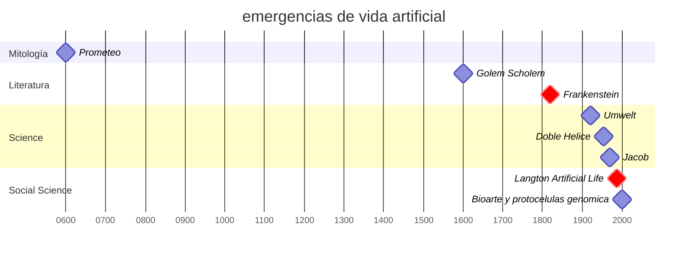

# gantt

```mermaid
gantt
    title Git Issues - days since last update
    dateFormat X
    axisFormat %s
    section Issue19062
    71   : -400, 71
    section Issue19401
    36   : 0, 36
    section Issue193
    34   : milestone, -200, 34
    section Issue7441
    9    : 100, 9
    section Issue1300
    5    : 0, 5

```

```mermaid
gantt
  title emergencias de vida artificial
  dateFormat  X
  axisFormat  %Y

  section Mithology
  Prometeo                        :milestone, -22083888000, 0

  section Literatura
  Golem Scholem                   :milestone, -11676096000, 0
  Frankenstein                    :crit, milestone, -4848576000, 0

  section Science
  Umwelt                          :milestone, -1577664000, 0
  Doble Helice                    :milestone, -536544000, 0
  Jacob                           :milestone, 0, 0

  section Social Science
  Langton Artificial Life         :crit, milestone, 536544000, 0
  Bioarte y protocelulas genomica :milestone, 946684800, 0
```

```mermaid
gantt
  title emergencias de vida artificial
  dateFormat  YYYY-MM-DD
  axisFormat  %Y
  todayMarker off

  section Mitología
  Prometeo                        :milestone, 0600-01-01, 1d

  section Literatura
  Golem Scholem                   :milestone, 1600-01-01, 1d
  Frankenstein                    :crit, milestone, 1818-01-01, 1d

  section Science
  Umwelt                          :milestone, 1920-01-01, 1d
  Doble Helice                    :milestone, 1953-01-01, 1d
  Jacob                           :milestone, 1970-01-01, 1d

  section Social Science
  Langton Artificial Life         :crit, milestone, 1987-01-01, 1d
  Bioarte y protocelulas genomica :milestone, 2000-01-01, 1d
```
